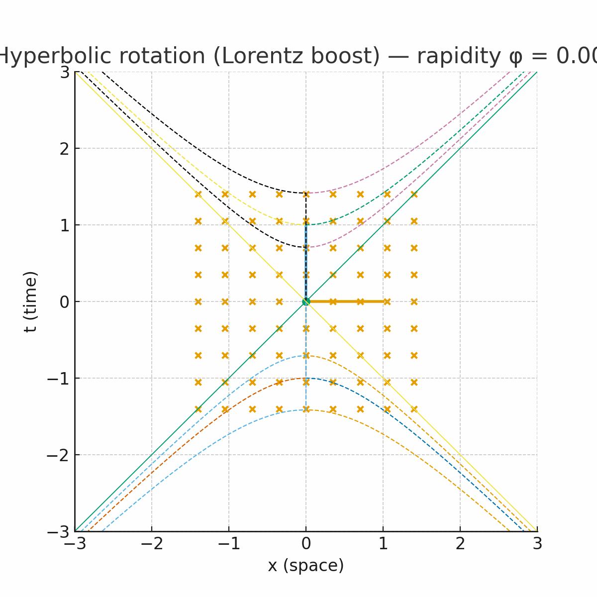

1. 🤔其实在静止时，在假想中，我们可以将一个点的约束视为任意形式

### 关于虚数和李群的一些思考🤔

​	首先，虚数似乎是一个奇怪的代数结构，其复合了二维中向量与旋转+缩放矩阵的概念，==这三者的自由度均为 $2$==

为方便考虑，我们约束复数的模为一，这样其就等价于单位向量和纯旋转矩阵，三者自由度均为 $1$

对于三维空间，根据其旋转的特性，我们可以很容易猜想，其旋转矩阵具有如下形式
$$
\left( \begin{matrix}
   d & { - a} & -c  \\ 
   a & d & { - b}  \\ 
   {  c} & b & d  \\ 

 \end{matrix}  \right)
$$
考虑到其自发的这种对称性，以及中间那堆玩意多半并非独立，我们可以通过类似虚数的方法引入一些奇怪的数，尝试构建四元数
$$
\left( {\begin{array}{*{20}{c}}
  d&{ - a}&{ - c} \\ 
  a&d&{ - b} \\ 
  c&b&d 
\end{array}} \right) = \left( {\begin{array}{*{20}{c}}
  d&0&0 \\ 
  0&d&0 \\ 
  0&0&d 
\end{array}} \right) + \left( {\begin{array}{*{20}{c}}
  0&{ - a}&0 \\ 
  a&0&0 \\ 
  0&0&0 
\end{array}} \right) + \left( {\begin{array}{*{20}{c}}
  0&0&0 \\ 
  0&0&{ - b} \\ 
  0&b&0 
\end{array}} \right) + \left( {\begin{array}{*{20}{c}}
  0&0&{ - c} \\ 
  0&0&0 \\ 
  c&0&0 
\end{array}} \right)
$$
并且，我们令
$$
\left( {a,b,c} \right)\sim\left( {\begin{array}{*{20}{c}}
  d&{ - a}&{ - c} \\ 
  a&d&{ - b} \\ 
  c&b&d 
\end{array}} \right)\sim d+ai+bj+ck
$$
构建一种等价关系

> 好像不太对，这里构造的逻辑绝对有很大问题，先不管了

$$

$$

## 关于狭义相对论的一些🤔

为保证我看得懂，先摆出双曲旋转的图

对于时空间隔：

基于光速不变的假设，我们可以推出洛伦兹变换，进而得到
$$
s^2=c^2t^2-x^2=C
$$
这是一个以 $ct$ 为实轴的双曲线，接下来，我们对坐标轴进行研究

首先是时轴的变换：

考虑到时空间隔的不变性以及洛伦兹变换的线性，我们可以必然得出原先参考系下的时间的单位元（图中蓝线）在新坐标系之下终点仍然位于一条双曲线之上，于是，我们就得到了新坐标系之下时轴的变化规律

接着是空间轴的变换：

考虑洛伦兹变换矩阵，可以得到 $x$ 轴和 $ct$ 轴的单位元长度始终相等

考虑光速不变以及洛伦兹变换的线性性质，则可以得到光速运动的直线（图中绿线 $ct = x$）必然位于两坐标轴的角平分线上

根据上面两条，我们可以必然得到图中棕色线为坐标变换后原先的空间轴的坐标

> 骗你的，其实看洛伦兹变换的矩阵就能看出这一定单位元一定是这样变化的

此外，根据洛伦兹变换的具体形式，我们还可以得到

1. 时轴的单位元只会在上半双曲线运动，这也就导致了 $C > 0$ 时事件之间存在绝对的先后顺序，不可能先后颠倒，也不可能间隔为 $0$ （这点可以部分由 $c^2t^2-x^2>0$ 看出）
2. $ C =  0$ 时，时间和空间
3. $C<0$ 是个什么情况呢？
