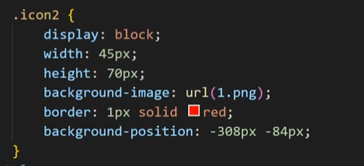

### 选择器

#### 全局选择器

可以与任何元素匹配，优先级最低

```css
*{
    color: black
}
```

一般只用于初始化

#### 元素选择器

HTML文档中的标签元素的选择器，作用范围为同种元素，==所有标签均可作为选择器==

```css
html{
    color = blue
}
```

#### 类选择器

用于特定类的元素，定义方式为`.name`

```css
.first{
    
}
```

引用方式为：

```html
<p class = first>
    
</p>
```

优先级高于元素选择器

#### Id选择器

优先级最高，用于指定Id的元素，定义方式为`#Id`

```css
#name{
    
}
```

引用方式为

```html
<p id = "name">
    
</p>
```

不过Id在html全局中是唯一的，不能够复用，不过这玩意的优先级最高（这或许是不用类选择器的原因❓）

#### 合并选择器

方便编写重复样式

```css
#name,h3{
    
}
```

可以一次定义上面几个重复的玩意

#### 内联选择器

优先级最高，直接在HTML中的元素里写的那个属性

### 字体属性

#### color

规定字体颜色

可使用

字体颜色、十六进制值、`rgb(0,0,0)`值、`rgba(0,0,0,.5)`值(rgba里的那个a表示透明度)

#### font-size

规定字体大小，具体数值自己查询

#### font-weight

设置文本粗细

#### font-style

字体样式

#### font-famliy

指定字体，从前往后，直到到达你电脑上有的那种字体为止

> + 每个值用逗号隔开
>
> + 若字体包含空格，必须用" "包裹

### 背景属性

|        属性         | 描述             |
| :-----------------: | ---------------- |
|  background-color   | 设置背景颜色     |
|  background-image   | 设置背景图片     |
| background-position | 背景图片显示位置 |
|  background-repeat  | 背景图片填充方式 |
|   background-size   | 背景图片大小     |

#### background-image

> 注，通过`url("")`设置路径

#### background-repeat

|    值     | 说明             |
| :-------: | ---------------- |
|  repeat   | 默认方式平铺     |
| repeat-x  | 只向水平方向平铺 |
| repeat-y  | 只向竖直方向平铺 |
| no-repeat | 不平铺           |

#### background-size

|     值     |                             说明                             |
| :--------: | :----------------------------------------------------------: |
|   length   | 设置图片宽度和高度，第一个为宽度，如果只设置宽度，高度自动调整 |
| percentage | 计算相对位置的百分比，第一个值计算宽度，只设置第一个第二个自动计算 |
|   cover    | 保持图片纵横比，并将图片缩放成完全==覆盖背景区域==的最小大小 |
|  contain   | 保持图片纵横比，并将图片缩放成完全==适合背景区域==的最小大小(不进行切割，但会平铺图片) |

#### background-position

图像的起始位置，默认值为`0% 0%`

|  左  |   中   |  右   |  上  |   下   |
| :--: | :----: | :---: | :--: | :----: |
| left | center | right | top  | bottom |

也可以用percentage指定每个值

也可以使用像素来指定`xpos ypos`

### 文本属性

#### text-align

文本水平对齐方式

|  左  |   中   |  右   |
| :--: | :----: | :---: |
| left | center | right |

#### text-decoration

文本修饰

常见类型

|    删除线    |  上划线  |  下划线   |
| :----------: | :------: | :-------: |
| line-through | overline | underline |

#### text-transform

控制文本大小写

| caprialize | 每个单词开头大写 |
| :--------: | :--------------: |
| uppercase  |   全部大写字母   |
| lowercase  |   全部小写字母   |

所以我自己写不好吗，还要它规定

#### text-indent

规定文本块中首行文本缩进（注，允许负值）

### 表格属性

#### 表格边框

`border`属性设置元素边框

`border-collapse`属性设置变宽重叠时是否缩成一个边框或分成两个边框

| collapse |  打  |
| :------: | :--: |
| 边框折叠 |      |

#### 表格宽度和高度

`width`属性和`height`属性

#### 文字对齐

`text-align`设置水平文字对齐方式

`vertical-align`设置垂直对齐方式

#### 表格填充

`padding`属性控制表格文本与表格边框之间的空间

### 关系选择器

#### 后代选择器

##### 定义

选择所有==被E元素包含的F元素==，中间用空格隔开

```css
E F{}
```

例子

```css
ul li{
    color : green;
}
```

#### 子代选择器

选择所有被E==直接包含==的子元素F（不包括隔代的包含，对更深层不起作用）

```css
E>F{}
```

#### 兄弟选择器

选择==紧跟E后==(ps，不能向上相邻)的元素F，二者并列且接近

```css
E+F{}
```

#### 通用兄弟选择器

选择E之后出现的所有F元素(ps,当后续标签被包裹时同样不适用)

```css
E~F{}
```

### box model盒子模型

实际上是一种封装一个元素的格式

包括对元素的

外边距（margin）、边框（border）、内边距（padding）、实际内容（content）进行设置

### flex box弹性盒模型

通过设置`display`属性的值为`flex`将其定义为弹性容器

弹性容器内包含一个或多个弹性子元素

> + 弹性盒模型的盒外和内部盒子均正常渲染，弹性盒子仅的定义弹性元素在其内部的布局
>
> + 弹性盒内元素默认横向摆放

#### `flex-direction`属性

指定弹性元素的排列

|      row      | 从左到右，左对齐 |
| :-----------: | :--------------: |
|  row-revese   | 从右到左，右对齐 |
|    column     |     纵向排列     |
| column-revese |   从下向上排列   |

#### `justify-content`属性

应用在弹性容器上，把弹性项沿着弹性容器的主轴线（main axis）对齐（🤔这里好像可以写一个树结构目录）

> ps，这是调整垂直结构的

| flex-start | 元素在该弹性元素中元素上至下摆放 |
| :--------: | :------------------------------: |
|   center   |             居中摆放             |
|  flex-end  |             从下至上             |

####`align-items`

设置弹性项在水平方向的摆放

| flex-start |   元素在该弹性元素中元素向左对齐   |
| :--------: | :--------------------------------: |
|   center   | 相中对齐（即最中间那个会在中轴线） |
|  flex-end  |              向右对齐              |

#### `flex-grow|flex`

根据弹性盒子所设置的拓展因子作为比率来分配剩余空间，默认为0（不放大）

```css
flex: 1
```

在每个子弹性元素中设置，无单位，会根据所有弹性子元素的和来计算该子元素在弹性盒子中所占空间

（就是一个权重）

> 注，当对子元素设置flex后，子元素的width等在与flex冲突时会失效
>
> 此外，这玩意缩放方式还与元素排列方式有关

### 浮动

增加一个浮层来放置内容

浮动以后元素脱离了文档流

`float`属性定义元素在哪个方向浮动（差不多就是在当前块内该元素居左开始还是居右开始），只能进行左右浮动

| left  | 向左 |
| :---: | :--: |
| right | 向右 |

脱离文档流之后，元素相当于在页面上面增加一个浮层来防止内容，一层是底层的原页面，一层是脱离文档流的上层页面，所以会出现折叠现象

当同一块内出现多个浮动元素时，元素会水平排列

==你没看消除浮层==

### 定位

`position`属性指定了元素的定位类型

|    值    |   描述   |
| :------: | :------: |
| relative | 相对定位 |
| absolute | 绝对定位 |
|  fixed   | 固定定位 |

其中绝对定位和固定定位会脱离文档流（不受文档中其它元素影响，且会盖住文档流的内容（换了个图层））

设置定位后，可以用四个方向值调整位置`left`、`right`、`top`、`bottom`

```css
h1{
    position: relative;
    left:100px
}
```

相对定位是相对于前文文档流

绝对定位是根据当前所处父级元素的位置调整（而非页面本身，也不是整个body）

固定定位是相对浏览器页面固定（网站滚动也会一直停在那）（小广告🤣）

> + 绝对定位根据代码从上到下一次生成，下面的绝对定位可以盖住上面的，而不是像浮动一样并列
> + 设置定位后，相对定位和绝对定位是相对于具有定位的父级元素进行调整，若父级元素不存在定位，则继续向上逐级寻找，直到到顶层文档（不过绝对定位可以跑到父级元素外面，父级元素只是起个定位作用）

`z-index`属性设置元素的堆叠，值越大，位置越高

```css
h1{
    z-index: 1;
}
```

`z-index`值较大的会覆盖较小的

### CSS3新特性

#### `border-radius`

指定圆角，可以有1~4个值

四个值：左上$\to$右上$\to$右下$\to$左下

三个值：左上$\to$右上和左下$\to$右下

两个值：左上和右下$\to$右上和左下

一个值：四个角

```css
.box{
    border-radius:15px 20px 25px 0
}
```

这个值是圆角的半径

#### `box-shadow`

向框内添加一个或多个阴影

```css
box-shadow: h-shadow v-shadow blur color
```

|    值    |        描述        |
| :------: | :----------------: |
| h-shadow | 必选，水平阴影位置 |
| v-shadow | 必选，垂直阴影位置 |
|   blur   |   可选，模糊距离   |
|  color   |   可选，阴影颜色   |

### 动画

动画使元素从一种样式逐渐变化为另一种样式

可以改变任意多的样式任意多的次数

使用百分比或用关键词"from"和"to"，等同于0%和100%

0%是动画的开始，100%是动画的完成

#### @keyframs创建动画

使用`@keyframs`规则创建

```css
@keyframs name{
    0%{
    }
    10%{
    }
    50%{
    }
    100%{
    }
}
```

+ name：动画名称
+ 百分比值可以有多个

#### animation执行动画

```css
animation: name duration timing-function delay iteration-count direction;
```

| 序号 | 子属性                        | 可取值示例                                                   | 作用说明                                                     |
| ---- | ----------------------------- | ------------------------------------------------------------ | ------------------------------------------------------------ |
| 1    | **animation-name**            | `slideIn`、none                                              | 指定要绑定的@keyframes 名称。                                |
| 2    | **animation-duration**        | `2s`、`500ms`                                                | 动画一次完整的持续时间。                                     |
| 3    | **animation-timing-function** | `ease`、`linear`、`ease-in-out`、`cubic-bezier(.17,.67,.83,.67)` | 时间曲线，决定动画加速/减速节奏。                            |
| 4    | **animation-delay**           | `0s`、`-1s`、`1s`                                            | 延迟多久才开始播放；负值表示“从动画中途开始”。               |
| 5    | **animation-iteration-count** | `1`、`2`、`infinite`                                         | 动画重复次数，`infinite` 无限循环。                          |
| 6    | **animation-direction**       | `normal`(动画向前播放)、`reverse`（偶数次向前，奇数次反方向）、`alternate`、`alternate-reverse` | 第偶数次是否反向播放。                                       |
| 7    | **animation-fill-mode**       | `none`、`forwards`、`backwards`、`both`                      | 动画未开始/结束后，元素是否保留首帧或末帧状态（可选，但常一起写）。 |

### 媒体查询

能够使页面根据设备的大小自动识别，加载不同样式

#### 设置meta标签

使用设备的宽度作为试图，并禁止初始缩放，在`<head>`中加入如下meta标签

```html
<meta name="viewport" content="width=device-width, initial-scale=1.0, maximum-scale=1.0, user-scalable=no">
```

+ `width = device-width`宽度设置为设备宽度
+ `intial-scale`初始缩放比例（默认1.0）
+ `maximum-scale`允许用户缩放最大比例（默认1.0）
+ `user-scalable`用户是否可以手动缩放（默认为no）

#### 媒体查询语法

```css
@media screen and (max-width: 768px) and (min-width: 320px) {
    body {
        flex-direction: column;
    }
}
```

+ max-width：最大宽度
+ min-width：最小宽度

差不多是一个if判断大小的语句，当屏幕宽度在此范围内执行操作

> ps，这些空格必须要有，包括and和（）间的

### 雪碧图

一种避免反复向网络请求资源的网页图片处理方式，允许将一个页面涉及到的零散图片集中到一个大图

+ 减少图片字节
+ 减少http请求，提高网页性能

#### 示例



这里利用块级元素，将单张图片设置为一个大型图片的某个位置某个区域的一个图片（不过合并那张图片也不容易吧🤔）

### 字体图标

我们经常会用到一些图标，但过多数量的图片会引起性能损耗，且有时会出现性能失真，因此可以用字体图标的方式来显示一些图标

<a href="https://www.iconfont.cn/">阿里字体图标库</a>

优点：

+ 轻量：加载速度更快，且减少http请求
+ 灵活：可利用css设置大小颜色
+ 兼容：网页字体支持所有现代浏览器

#### 使用方式

+ 选取或搜索图标
+ 将相应图标添加至购物车
+ 下载==代码==
+ 之后就可以用啦（实在不会用可以看压缩包里的说明html）
