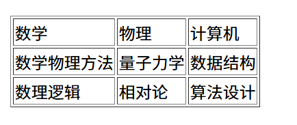

🤔学这玩意像是把markdown中的内容换个语法学一遍

## html基本介绍

###html5介绍

HTML5是用来描述网页的一种语言，被称为==超文本标记语言==，后缀以`.html`结尾

### HTML5的DOCTYPE声明

DOCTYPE式`document type`的缩写。`<!DOCTYPE html>`是H5的声明，位于文档最前面，处于标签之前，避免浏览器的怪异模式（因浏览器不同导致的显示效果不同）

### HTML的基本骨架

#### \<html\>

定义html文档，包裹整个html文件

#### \<head\>

用于定义文档的头部，描述了文档的各种属性和信息，包括文档的标题，在Web中的位置以及和其它文档的关系等。==绝大多数文档头部包含的数据都不会真正最为内容显示给读者==

####\<body\>

定义文档主题，包含文档中的所有内容，会直接在页面中显示出来

####\<tytle\>

+ 定义文档的标题

+ 显示在浏览器窗口的标题栏或状态栏上

+ 是`<head>`中必须包含的东西

+ 有利于SEO优化

  > SEO是搜索引擎优化的英文缩写，通过对网站内容调整，控制内容出现顺序

#### \<meta\>

包含在`<head>`中，用于描述HTML网页文档的属性，关键词等，如

```html
<meta charset = 'utf-8'> # 指定编码格式
```

注意，`<meta>`为单标签，无结尾，内容包含在标签内部

可以多次出现`<meta>`

## 标签

###标题标签

使用`<h n></h n>`定义，$n\in[1,6]$共六级标题😭

```html
<h1>
    一级标题
</h1>
```

vscode快捷键输入`h$*6`，生成1~6级标题

可在标签中添加属性

`align = "left|center|right"`来指定标题对齐位置

注意：

+ 不要为了生成粗体而使用
+ 注意规范使用

### 文本中的标签

####段落标签

通过`<p>这是一个标签</p>`定义

#### 换行标签

通过`<br>这是一行的内容</br>`

定义的这一行内容独立于上一行和下一行

此外，\<br\>（也可写为\<br /\>🤔相当于表示标签结束？）可以单标签，在段落内使用，形成换行效果

####水平线标签

为单标签

```html
<hr color = "" width = "" size = "" align = "">(属性设置可省略)
```

+ color颜色

+ width长度

  > 内容可以为 "n%"（线长占窗口的比例）n可大于100
  >
  > 也可为"n px"（px为像素的单位）等

+ size宽度

  > 内容也可以为“n px"等

+ align位置（默认居中）

#### 图片

``标签定义HTML中的图片，为单标签

#####属性：

+ src：路径（图片地址与名称）（当在同一目录下可以直接给名称）

  > 绝对路径：从盘符开始
  >
  > 相对路径：（其实和linux是一个样子来着）
  >
  > + 子级关系`/`
  >
  > + 父级关系`../`
  >
  > + 同级关系`./`
  >
  >   不过同级关系可以直接给名称了😭
  >
  > 网络路径：具体的网址

+ alt：规定图像的代替文本（当图片无法显示时显示）

+ width：规定图像宽度

+ height：规定图像高度（当之规定宽度时，高度会默认按照图片原比例缩放）

+ title：鼠标悬停在图片上时给予提示

+ align：位置

#### 超文本链接

HTML可以使用标签``<a>``来设置，用于跳转到某个网页，文档，文档的某个位置等

超链接可以是文本，图像等许多内容

```html
<a herf = > 这是一个链接 </a>
<a></a>
```

##### 属性

在标签`<a>`中使用`herf`属性来描述链接的地址

默认情况下，链接将以如下方式显示：

+ 一个未访问过的链接显示未蓝色字体并带有下划线。

+ 访问过的链接显示为紫色并带有下划线

+ 点击链接时，链接显示为红色并带有下划线

  > 后期可通过CSS样式修改

### 文本标签（用于给文本一些特殊效果）

常用的文本标签

| 标签       | 描述                                    |
| ---------- | --------------------------------------- |
| `<em>`     | 定义着重文字                            |
| `<b>`      | 定义粗体文字                            |
| `<i>`      | 定义斜体文字                            |
| `<strong>` | 定义加重语气                            |
| `<del>`    | 定义删除字                              |
| `<span>`   | 元素没有特定含义（方便后期添加CSS样式） |

> `<strong>`与`<em>`显示相同，但在使用屏幕阅读器时后者会加重语气

此外，文本标签可以嵌套

### 列表标签

#### 有序列表

有序列表是一列项目，列表项目使用数字标记，始于`<ol>`标签，其中每个表项始于`<li>`标签

```html
<ol>
    <li>第一项</li>
    <li>第二项</li>
</ol>
```

此外，有序列表可以嵌套

##### 属性（可以用""包裹，也可以不用，不过还是建议包裹）

==type==属性：作用于`<ol>`

+ 1 表示使用数字标号
+ a 小写字母标号
+ A 大写字母
+ i 小写罗马字母
+ I 大写罗马字母

####无序列表（可以用来做网站导航）

始于`<ul>`标签，每个列表项使用`<li>`标记

```html
<ul>
    <li>第一项</li>
    <li>第二项</li>
</ul>
```

同样可以嵌套

##### 属性（与有序列表类似）

同样具有==type==属性

+ disc 默认实心圆
+ circle 空心圆
+ square 小方块
+ none 不显示

VS中的快捷生成`ul>li*n`快速生成一个含n行的无序列表，ol同理

####表格

`<table>`：表格

+ border：设置表格边框
+ width：设置表格宽度
+ heigth：设置表格高度

`<tr>`：行

`<td>`：单元格（列）

`<th>`表头

+ colspan = "n"：`<td>`和`<th>`共用，指定该单元格所占列数
+ rowspan = "n"：垂直合并，也是单元格属性，而非行属性

ps：表格相关属性较多，一般通过CSS调整

```html
    <table border="1" align="center">
        <tr>
            <td >数学</td>
            <td>物理</td>
            <td>计算机</td>
        </tr>
        <tr>
            <td>数学物理方法</td>
            <td>量子力学</td>
            <td>数据结构</td>
        </tr>
        <tr>
            <td>数理逻辑</td>
            <td>相对论</td>
            <td>算法设计</td>
        </tr>
    </table>
```

运行结果



快速生成`table>tr*n>td*m{填充文本信息}`

#### 表格单元格合并

+ colspan = "n"：`<td>`和`<th>`共用，指定该单元格所占列数

+ rowspan = "n"：垂直合并，也是单元格属性，而非行属性

  > ps，这玩意用起来效果很迷，建议用着看看，（而且很容易弄乱格式🤔）

水平合并保留左边，删除右边，垂直合并保留上边，删除下边（其实就是调整单个单元格长宽）

###Form表单

用于给用户填写信息，从而能够采集用户信息，使网站具有交互功能

表单由容器和空间组成，一个表单一般包含用户填写信息的输入框，提交按钮等，这些称为控件，表单就是容器

```html
<form action = "url" method = "post|get" name = "myform"></form>
```

####属性

+ action ：服务器地址

+ method：数据提交方式

  > + get：提交数据url可以看到，一般用于少量数据提交
  > + post：提交的数据url不可见，用于提交大量数据

+ name：表单名称

#### 表单元素

一个完整的表单包括三个基本组成部分：表单标签，表单域，表单按钮

+ 表单标签

+ 表单域（输入框）

  ```html
  <input>
  ```

+ 表单按钮

  `<input>或<button></button>`

#### 表单元素属性

`<input>`有多种属性

+ type属性：

  > text ：文本域，用于输入内容
  >
  > password：密码框（输入内容不进行明文显示）
  >
  > submit：提交按钮
  >
  > reset：重置按钮

+ name属性：

  用于在提交表单时标识数据字段（相当于变量名），未设置name的表单字段==不会被提交==

+ value属性：

  提交表单字段的当前值，可以用于

  + 设置文本域，密码框等的默认内容
  + 为按钮设置特定的名称

+ onclick属性：

  用于按钮受到点击后执行操作

### 块元素与行内元素（内联元素）

|               块级元素               |                行内元素                |
| :----------------------------------: | :------------------------------------: |
| 在页面中独占一行（自上而下垂直排列） |   不会独占页面中的一行，只占自身大小   |
|       可以设置height,width属性       |       不可以设置height,width属性       |
|    可以包含行内元素和其它块级元素    | 一般只能包含内联元素，不能包含块级元素 |

常见块级元素（换行，能够识别宽高）

> `div`，`form`，`h1~h6`，`hr`，`p`，`table`，`ul`

常见内联元素（不换行，不能识别宽高）

> `a`，`b`，`em`，`i`，`span`，`strong`

行内块级元素（特点：不换行，但能够识别宽高等）

> `button`，`img`，`input`等

### HTML5新增标签

`<div>`：容器标签

类似于封装函数等，利于模块化编写页面，也利于后期进行CSS添加

+ `id`属性：用于表示代码块（这玩意是许多标签通用的哈）

#### HTML5（可能要求新版本浏览器，这玩意2014年出的）

HTML5新增了一些``<div id = "">``的替代品用于标识，如

> ps，这些真就只是方便你认识，并不会给你直接建立好侧边栏，头部等

+ `<header></header>`可用于替换`<div id = "header"></div>`代表代码块内部正在写头部

+ ```html
  <nav></nav>等价于<div id = "nav"></div>
  ```

  导航

+ ```html
  <section></section>定义文档中的节（如章节，页眉等）
  ```

+ ```html
  <aside></aside>侧边栏
  ```

+ ```html
  <footer></footer>脚部
  ```

+ ```html
  <article></article>代表一个独立的、完整的相关内容块，如一篇帖子，一个评论等
  ```
