标识符

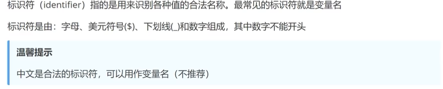

## 变量

###定义

```js
var num = 10;
```

### 变量提升

JavaScript变量解析的方式会导致任意位置声明的变量在运行中实际上会在代码开始执行时就被声明

（也就是说你可以先使用某个变量，后来再写声明）

## js引入到文件

+ 嵌入到HTML中

  ```html
  <script>
      var num = 10
  </script>
  ```

+ 引入本地独立js（可在head或body中）

  ```html
  <script src = "js路径">
  </script>
  ```

+ 引入网络来源js

  与本地引入一致

## 注释与常见的输出方式

```js
// 单行注释
/*
多行注释
*/
```

```html
<!--嵌入在html中可用这种注释-->
```

### JS的常见输出方式

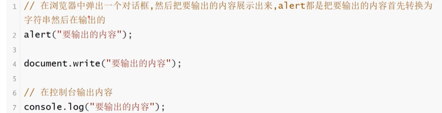

+ document直接将内容输出到当前页面

## 数据类型

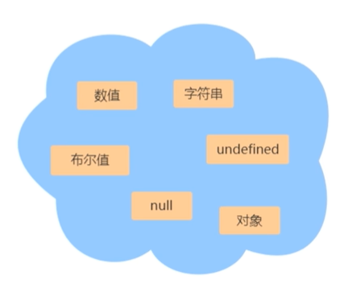

ES6新增`Symbol`类型和`BigInt`类型

和python差不多，什么类型取决于定义时的赋值

对象：(和python里的字典差不多)

```js
var user = {
    name:"das"
    age:18
}
```

## typeof运算符

```js
typeof a # 判断基本数据类型
```

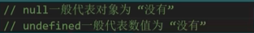

### 运算符

其它运算符与C++类似

##比较运算符增添

`===`与`!==`表示严格相等/不相等，`==`和`!=`的语义也不同

```js
var num1 = 10
var num2 = "10"
num1 == num2 //True这个跨类型就很迷
num1 === num2//False
```

比较运算符为

##非`!`，且`&&`，或`||`

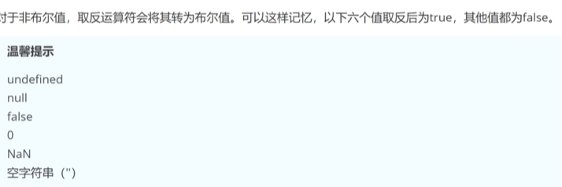

与C++一样，会在能够判断TURE或FALSE后直接输出，不进行后续语句判断

```js
var num = 1;
0 && num++;
//得到num = 1，不执行num++
```


#### 一致部分

各种数值运算符，包括`a++,++a`

```js
if(){}else{}

switch(num){
    case 1:
        break;//break缺失与C++情况相同
    default:
}

条件 ? True : False

for(var i = 1 ; i <= 100 ; i++){
    //看到这就不用说了吧
    //此外，分号不能删，无论有没有内容（🤔老路子，不过这部分细节确实以前不太在意）
}

while(){
    break;
    continue;//这俩也一样🤔
}
```

### 字符串

`"abs"`或`'abs'`

单引号和双引号可以互相嵌套，但同种引号内嵌套时需要用转义符`\`来实现

字符串默认只能写在一行内，否则会报错

```js
"abs\"abs\""
'abs\'abs\''
```

```js
str = "hello"
str.length //字符串长度（不用减一）
```

#### 常用方法

```js
str.charAt(num) //返回字符串num位置的字符
//当参数不在字符串范围内返回空字符串

str.concat("abs") //返回str与"abs"连接后的字符串，不改变str，此外，可有多个参数
//若参数不是字符串，则会将其先转换为字符串后连接
//str.concat("abs",12)
//与str + "abs"同义（等会，这玩意不会能字符串加数吧😂）

str.substring(num1 , num2)//返回str1至num2-1位置的字符串
//当num2>num1时，二者自动换位，负值会自动变为0
//只含num1时，默认到字符串末尾

str.substr(num1,num2)
//与substring不同，num1为负数表示倒数第几个，num2为负数则变为0

str.Indexof(str2,num)
//确定str2在str中第一次出现位置，返回-1表示不匹配
//可接受两个参数，表示从str某个位置开始向后匹配

str.trim()
//返回删除str两端的制表符\t,\v，换行符\n，回车符\v，空格后的字符串
//ES6拓展方法 trimStart和trimEnd 人如其名

str.split()
//按照指定规则分割字符串，返回分割出来的子字符串组成的数组
'it|is|a|dog'.split('|')//['it','is','a','dog']
//若用空字符串作为分割规则，则返回数组的成员为每个字符，若省略参数，则返回原字符串
//可接受两个参数，代表返回数组最大成员数
'it|is|a|dog'.split('|',2)////['it','is']
```

### 数组

与python数组一致，数组内容可以是任意类型

此外，数组大小可变化，可以直接用这种语法增添元素

```js
a = [1,2,3]
a.length//3
a[3] = [4]
a.length//4
```

数组具有length属性

此外，数组的遍历可以使用

```js
for(var i in a){
    
}
```

（什么C++与Python混合体🤣）

#### 方法


### 函数

#### 声明

```js
function printf(x){//ps，这里不用var哦（这玩意不要求类型就抽象）
    console.log(x)//😘这不就变成C了
    return 0;
}
```

与一般变量定义一致，函数的声明可以再调用之后写（反正执行时会把声明提到最前面）

返回同样用`return`

### 对象

### 声明

对象是一组“键值对”的集合，是一种无序的复合数据

```js
var user{
    name:"das"
    age:213
    getName: function (){
        return this.name;
	}
    //这个写法挺神奇
};
```

键值对的值也无类型限制，可以为函数或对象

读取方式为`对象名.属性`


### Math对象

提供一堆数学功能，JavaScript原生对象

```js
Math.abs(-1)//1
Math.min(1,2,3)
Math.max(312,43)
Math.min()//-infinity
Math.max()//infinity
Math.floor()//返回小于参数的最大整数
Math.ceil()//返回大于参数的最小整数
Math.random()//返回0-1间的一个伪随机数
```


### Date对象

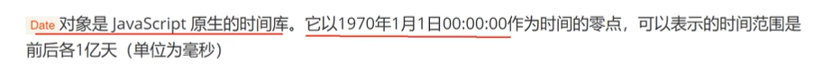

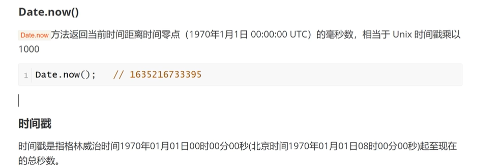

你喵，让我写个转换时间的函数是吧

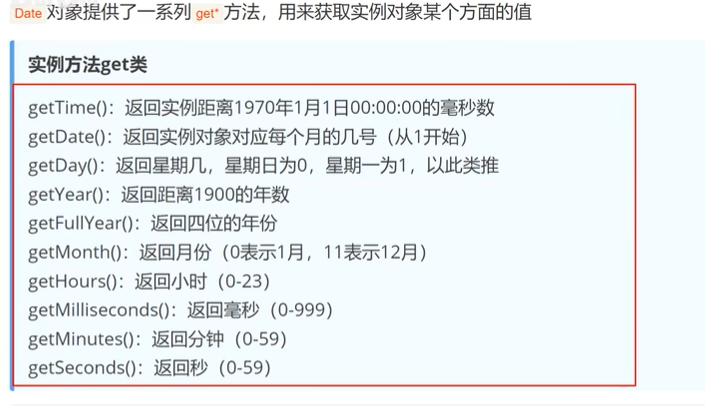

```js
now = new Date()
alert(now.getFullYear)
//此外，Date可以将时间戳作为参数，获得该事件戳的Date对象
```


### DOM

DOM是JavaScript操作网页的接口，全称为“文档对象模型”。他的作用是将网页转为一个Javascript对象，从而可以用脚本进行各种操作

浏览器会根据DOM模型，将结构化文档HTML解析成一系列节点，再由这些节点组成一个树状结构，所有的节点和最终的树状结构，都有规范的对外接口

DOM共有七种类型

+ Document：整个文档树的顶层节点
+ DocumentType：doctype标签
+ Element：网页的各种HTML标签
+ Attribute：网页元素的属性（比如class）
+ Text：标签之间或标签包含的文本
+ Comment：注释
+ DocumentFragment：文档的片段

####document对象(html部分)读取元素

##### document.getElementsByTagName()

获取指定标签内容的变化

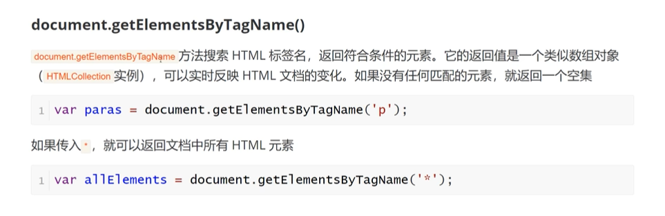

```js
var divs = document.getElementsByTagName("div")
```

该命令会获取所有div内容，存储到类似数组的东西（ps，就算只有一个，得到的也是一个数组），可通过

```js
div[0]
```

这种类似数组的命令选择读取哪一个div块的内容，可以通过下面方法修改

```js
div[0].innerHTML = "Hello"
```

##### document.getElementsByClassName()

读取所有使用相同class的标签的内容，修改方式与上面类似

注意，这里的==参数是选择器==

+ ID：#IdName
+ Class：.ClassName

而非只给出名字即可，必须加上#或.的前缀

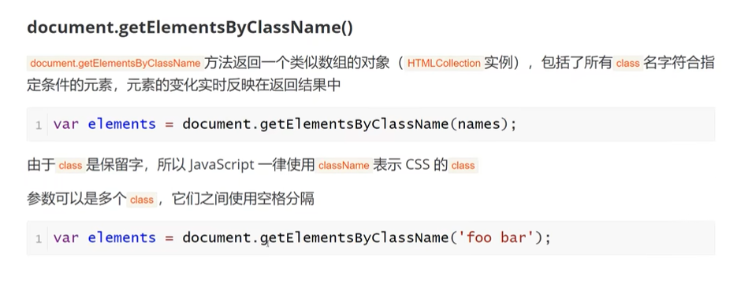

##### document.getElementsByName()

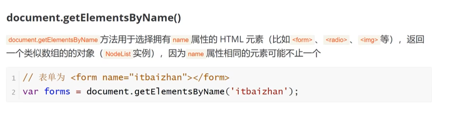

#### document.getElementById()

若出现多个同ID，则返回遇见的第一个

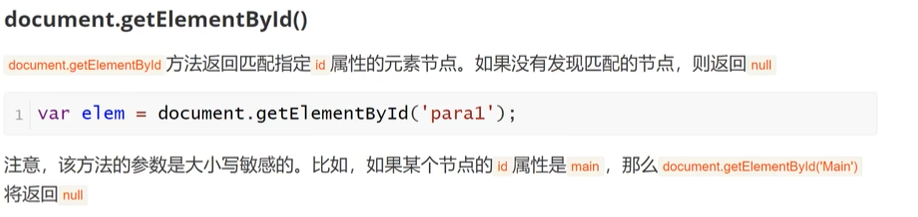


#### document对象(CSS部分)

##### document.querySelector()

若出现多个相同CSS选择器，则返回第一个

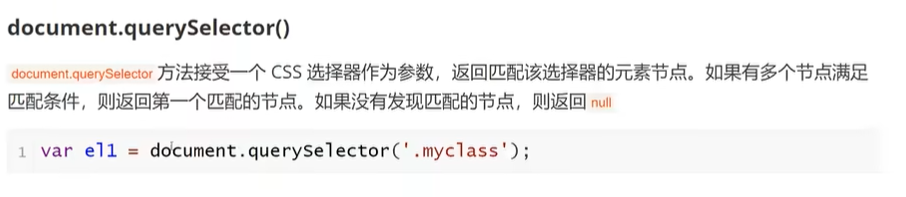

#####document.querySelectorAll()

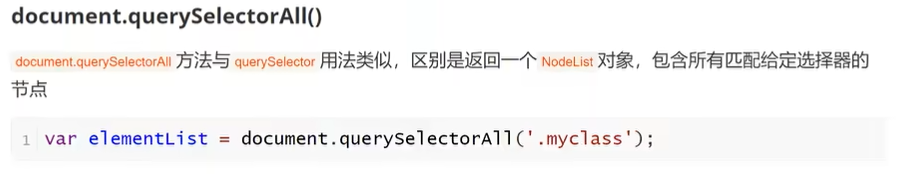

这两玩意和上面那个ByClassName很像，但得到的为静态对象，若后续增删了对象，需要重新获取，否则内容不变


#### document对象创建元素

##### document.creatElement()

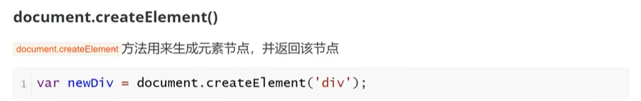

##### document.creatTextNode()

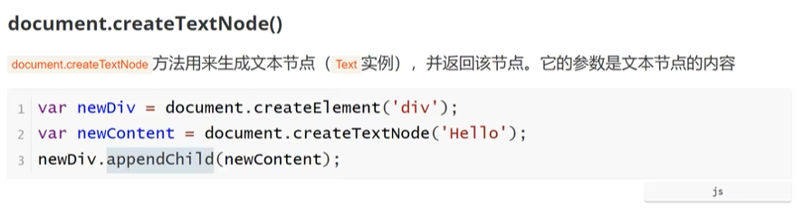

其实就相当于将文本节点也视为一个子标签的操作逻辑

`appendChild`方法用于将生成的文本节点插入标签（此外，标签等也通过该方式插入）

#####document.creatAttribute()

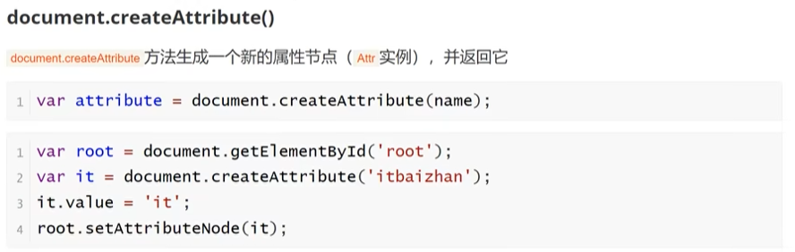

利用`setAttributeNode()`插入属性节点


####ELement对象

Element对象对应网页的HTML元素。每一个HTML元素，在DOM树上都会转化成一个Element节点对象（yixai）
