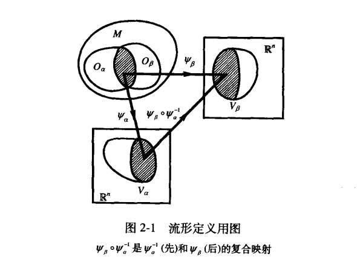
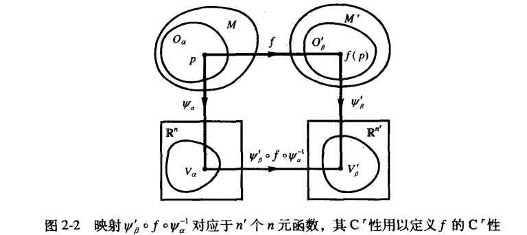

## \[\S2.1\] 微分流形

这玩意感觉更多的是理解空间结构有用🤔
​	粗略地说，微分流形是==带有微分结构的拓扑空间==，局部地看像 \[\R^n\] 整体上可能具有其它结构

**定义一**	拓扑空间 $(\mathbf{M},\mathcal T)$ 称为 **$n$ 维微分流形(n-dimensional differentiable manifold)** ，简称 $n$ 维流形，若 $\mathbf{M}$ 有开覆盖 $\{O_\alpha\}$ ，即 $\mathbf{M}=\bigcup\limits_\alpha O_\alpha$ ，满足：

(a)对每一个 $O_\alpha$ $\exist$ 同胚 $\psi_\alpha:O_\alpha\to V_\alpha$ ($V_\alpha$ 是 $\R^n$ 用==通常拓扑==衡量的开子集)；

(b)若 $O_\alpha\bigcap O_\beta\not=\empty$ ，则复合映射 $\psi_\beta\circ\psi_\alpha^{-1}$ 是 $C^\infin$ (光滑)的。

> 注意，$\psi_\alpha,\psi_\beta$ 具有任意性🤔所以这玩意要求好像挺强的🤔

 

> 🤔微分流形似乎就是把给定拓扑空间通过某种方式与通常想象中的 $\R^n$ 同构

**定义二**	坐标系 $(O_\alpha,\psi_\alpha)$ 在数学上又叫做 **图(chart)**，满足定义1条件(a)、(b)的全体图的集合 $\{(O_\alpha,\psi_\alpha)\}$ 叫**图册(atlas)**。条件(b)又称**相容性(compatibility)条件**，因此说一个图册中的任意两个图都是相容的。

> 当 $n$ 维微分流形可以用只含一个图的图册定义时，称之为 **平凡图册(trivial atlas)** 

**定义三**	$f:\mathbf{M}\to\mathbf{M}'$ 称为**$\mathbf{C}^r$ 类映射** ，如果 $\forall p\in\mathbf{M}$ ，映射 $\psi_\beta'\circ f\circ\psi_\alpha^{-1}$ 对应的 $n'$ 个 $n$ 元函数是 $C^r$ 类的

 

> 由于同一图册中各图相容，是否 $C^r$ 与图 $(O_\alpha,\psi_\alpha)$ 选取无关
>
> 
 
>     毕竟原则上来说应该得考虑同一个点可能对应多个图的情况
> 

**定义四**	微分流形 $\mathbf M$ 和 $\mathbf M'$ 称为**互相微分同胚(diffeomorphic to each other)** ，若 $\exist f:\mathbf M\to \mathbf M'$ ，满足

(a) $f$ 是一一到上的；

(b) $f$ 及 $f^{-1}$ 是 $C^\infin$ 的。

这样的 $f$ 称为从 $\mathbf M$ 到 $\mathbf M'$ 的**微分同胚映射**，简称**微分同胚(diffeomorphism)**

> 微分同胚似乎是指两个微分流形

**定义五**	$f:\mathbf M\to\R$ 称为 **$\mathbf M$ 上的函数(function on $\mathbf M$)**或 **$\mathbf M$ 上的标量场(scalar field on $\mathbf M$)**。若 $f$ 是 $C^\infin$ 的，则称为 **$\mathbf M$ 上的光滑函数**。$\mathbf M$ 上全体光滑函数的集合记作 $\mathcal F_M$ ，在不会混淆时简记为 $\mathcal{F}$ 。今后在提到函数而不加声明时都是指光滑函数。

 

> **连通connnected**：若拓扑空间 $(M,\mathcal T)$ 只有 $M$ 和 $\empty$ 两个既开又闭的集合，则称之为连通
>
> 