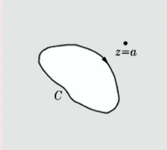
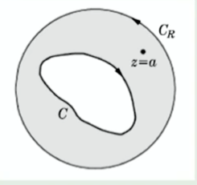

## $\S 4$Cauchy积分公式

###有界区域的 Cauchy 积分公式

设 $f(z)$ 是区域 $\overline{G}$ 中的单值解析函数，$\overline{G}$ 的边界 $C$ 是分段光滑曲线，$a$ 为 $G$ 内一点，则

$$
f(a) = \frac{1}{2\pi i} \oint_C \frac{f(z)}{z - a} \mathrm{d}z\tag{4.1}
$$


其中积分路线沿 $C$ 的正向

> 要点是解析函数解析域内的变形定理和小圆弧定理

特殊形式

取$C$为以$a$为圆心，$R$为半径的圆周，$z-a=Re^{i\theta}$

$$
\begin{align}
\mathrm{d}z&=R\mathrm{e}^{\mathrm{i}\theta}\mathrm{i}\mathrm{d}\theta\\ f(a)&=\frac{1}{2\pi}\int_{0}^{2\pi}f\left(a+R\mathrm{e}^{\mathrm{i}\theta}\right)\mathrm{d}\theta
\end{align}\tag{4.2}
$$
由此得出==均值定理==：

​	解析函数$f(z)$在解析区域$G$内任意一点$a$的函数值$f(a)$,等于 (完全位于$G$内的)以$a$为圆心 的任一圆周上的函数值的平均

### 无界区域的Cauchy积分公式

如果 $f(z)$ 在简单闭合围道 $C$ 上及 $C$ 外解析，且当 $z \to \infty$ 时，$f(z) \to 0$（即$f(z)$在$C$的包含$\infin$的轨迹内解析），则 Cauchy 积分公式

$$
f(a) = \frac{1}{2\pi i} \oint_C \frac{f(z)}{z-a} \, \mathrm{d}z\tag{4.3}
$$
仍然成立，此处 $a$ 为 $C$ 外一点，积分路线 $C$ 为顺时针方向

> 这里相当于考虑无穷远点的围道🤔，不过这似乎与平面到球面后各种基本特性是否保持有关？❓

> proof.
>
> 对于无界区域，需要假设 $f(z)$ 在简单闭合围道 $C$ 上及 $C$ 外 (包括无穷远点) 单值解析. 类似地，现在计算
>
> ```math
> \frac{1}{2\pi i} \oint_C \frac{f(z)}{z-a} \mathrm{d}z
> ```
>
> 其中 $a$ 为 $C$ 外一点，积分路线 $C$ 的走向是顺时针方向，即绕无穷远点的正向
>
> 
>
> 在$C$外再作一个以原点为圆心，$R$为半径的大圆$C_R$，
>
> 
>
> 这样，对于$C$和$C_R$所包围的复连通区域，根据有界区域的 Cauchy 积分公式，有：
>
> ```math
> \frac{1}{2\pi\mathrm{i}}\oint_{C_{R}}\frac{f(z)}{z-a}\mathrm{d}z+\frac{1}{2\pi\mathrm{i}}\oint_{C}\frac{f(z)}{z-a}\mathrm{d}z=f(a)
> ```
>
> 当$R\to \infin$时，显然$C_R$必然能够包括$C$和$a$，此时，由大圆弧引理
>
> ```math
> \lim_{R\to \infin}\frac{1}{2\pi\mathrm{i}}\oint_{C_R}\frac{f(z)}{z-a}\mathrm{d}z = f(\infin)
> ```
>
> 因此，当$f(\infin)\Rightarrow 0$时，可以得到无界区域的Cauchy积分公式