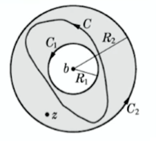
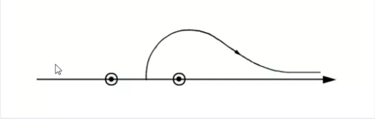

## Laurent展开

### Laurent展开定理

设函数 $f(z)$ 在以 $b$ 为圆心的环形区域 $R_1\leq\abs{z-b}\leq R_2$ 上单值解析，则对于环域内的任何 $z$ 点， $f(z)$ 可以展开为Laurent级数

$$
\begin{align}
f(z)&=\sum_{n=-\infin}^{\infin}a_n(z-b)^n,R_1\leq\abs{z-b}\leq R_2\tag{3.1}\\
a_n&=\frac{1}{2\pi i}\oint_C\frac{f(\zeta)}{(\zeta -b)^{n+1}}d\zeta\tag{3.2}
\end{align}
$$


$C$是环域内绕内圆一周的任意一条闭合曲线

### 证明

如图



对于环形区域内任意一点$z$，有

$$
f(z)=\frac{1}{2\pi\mathrm{i}}\oint_{C_{2}}\frac{f(\zeta)}{\zeta-z}\mathrm{d}\zeta-\frac{1}{2\pi\mathrm{i}}\oint_{C_{1}}\frac{f(\zeta)}{\zeta-z}\mathrm{d}\zeta\tag{3.3}
$$
对于沿着$C_1$的积分，有

$$
\begin{aligned}
-\frac{1}{2\pi\mathrm{i}}\oint_{C_{1}}\frac{f(\zeta)}{\zeta-z}\mathrm{d}\zeta
&=\frac{1}{2\pi\mathrm{i}}\oint_{C_{1}}\frac{f(\zeta)}{(z-b)-(\zeta-b)}\mathrm{d}\zeta\\
&=\frac{1}{2\pi\mathrm{i}}\oint_{C_{1}}\frac{f(\zeta)}{z-b}\sum_{k=0}^{\infty}\left(\frac{\zeta-b}{z-b}\right)^{k}\mathrm{d}\zeta\\
&=\sum_{k=0}^\infty\left[\frac{1}{2\pi\mathrm{i}}\oint_{C_1}f(\zeta)(\zeta-b)^k\mathrm{d}\zeta\right](z-b)^{-k-1}\\
&=\sum_{n=-1}^{-\infty}\left[\frac{1}{2\pi\mathrm{i}}\oint_{C_1}\frac{f(\zeta)}{(\zeta-b)^{n+1}}\mathrm{d}\zeta\right](z-b)^n,\abs{z-b}>R_1
\end{aligned}\tag{3.4}
$$
而对于沿着$C_2$的积分，与Taylor展开证明一致，有

$$
\frac{1}{2\pi\mathrm{i}}\oint_{C_{2}}\frac{f(\zeta)}{\zeta-z}\mathrm{d}\zeta=\sum_{n=0}^\infty\left[\frac{1}{2\pi\mathrm{i}}\oint_{C_2}\frac{f(\zeta)}{(\zeta-b)^{n+1}}\mathrm{d}\zeta\right](z-b)^n\tag{3.5}
$$


合并后统一积分路径为$C$就可以得证

> ==统一路径==的实现：
>
> 对于对$C_1$的积分部分，显然可以将$C_1$连续变形为$C$
>
> 而对于$C_2$的积分部分，可以将其化为一个绕点 $z$ 的小圆$C_3$和一个不包括$z$在内的曲线$C_4$，而$C_4$可以连续变换成$C$，而对于$C_3$，由于该曲线不经过$b$，容易得到
>
> ```math
> \oint_{C_{3}}\frac{f(\zeta)}{(\zeta-b)^{n+1}}d\zeta=0
> ```
>
> 由此就可以将对$C_1$和$C_2$的积分化到一个统一的$C$
>
> 若$z$在曲线$C$内，可以类似证明
>
> 🤔可是如果是对无穷级数来算的话，那就肯定可以连续变形🤔，那我这样写到底有没有意义呢🤔（好吧，我傻了，后面那个$(z-a)$直接忘了）

### 展开条件

1. 条件可以放宽为$f(z)$在环形区域 ==$R_1< \abs{z-b} < R_2$== 内单值解析

2. Laurent展开的系数==（即使是正幂项的系数）==

   $$
   a_n\not=\frac{1}{n!}f^{(n)}(b)\tag{3.6}
   $$
   

   > 🤔这里的主要问题其实是即使 $f^{(n)}(b)$ 存在，但由于圆 $C_1$ 含有不解析部分（不一定是点，可以是一个断层的线等），已经不能用积分表示 $f^{(n)}(b)$ 了

3. $f(z)$ 在 $C_1$ 内不解析

   + 一般来说，在 $C_1$ 上有奇点
   + 至于$b$点，可能是$f(z)$的奇点，也可能是$f(z)$的解析点
   + 如果$b$点是$C_1$内的唯一奇点，则$C_1$可以无限缩小，收敛范围就变成$0<\abs{z-b}<R$.这是就得到$f(z)$在孤立奇点$b$的邻域内的Laurent展开

4.  $f(z)$ 在$C_2$外不解析

   + 一般来说，在$C_2$上有奇点
   + 外圆$C_2$半径也可以是$\infin$，甚至在$\infin$也收敛

5. Laurent展开既有正幂项，又有负幂项

   + 正幂项在圆 $C_2$ 内绝对收敛，在 $C_2$ 内的任意一个闭区域中一致连续，称为Laurent级数的正则部分
   + 负幂项在圆 $C_1$ 外绝对收敛，在$C_1$外的任意一个闭区域中一致连续，称为Laurent级数的主要部分

   > 这两点性质可以总二者的由来判断，在相应的区域内，一个可以视作有限环域内的解析Cauchy积分公式，一个可以视作有限环域外解析的Cauchy积分公式

   + 两部分合起来就构成Laurent级数，在环域内绝对收敛，在环域内任意一个闭区域中一直连续
   + 当 $R_1=0$ 时，Laurent级数的主要部分就完全反映了 $f(z)$ 在 $z=b$ 点的奇异性

6. Laurent展开的唯一性

   > 假定存在两个不同的Laurent级数
   >
   > ```math
   > f(z)=\sum_{n=-\infty}^{\infty}a_{n}(z-b)^{n}=\sum_{n=-\infty}^{\infty}a_{n}^{\prime}(z-b)^{n}
   > ```
   >
   > 两端同时乘以 $(z-b)^{-k-1}$ ，由于Laurent级数的收敛性，可以进行逐项积分，进而得到
   >
   > ```math
   > 2\pi ia_n\delta_{nk}=2\pi ia'_n\delta{nk}
   > ```
   >
   > 进而得证

   与Taylor展开类似，这表明了对于==同一个环域==内的Laurent展开唯一且此时可以比较系数

### $\infin$邻域内的Laurent展开

#### 定义

如果 $z=\infin$ 是==函数 $f(z)$ 的奇点==，而在 $z=\infin$ 的邻域内单值解析的话，则可将 $f(z)$ 在 $\infin$ 点的邻域内作Laurent展开（相较于Taylor仅有 $f(\infin)$ 可不存在的区别）

即

$$
\begin{aligned}
f(\frac{1}{t})=\sum_{n=-\infin}^\infin a_n t^n,0<\abs{t}<r\\
f(z)=\sum_{n=\infin}^\infin a_n z^{-n},\frac{1}{r}<\abs{z}<\infin
\end{aligned}
\tag{3.7}
$$


只是此时对于$z$而言，负幂次项称为正则部分，正幂项称为主要部分，正幂项完全反应了 $f(z)$ ==在 $\infin$ 的奇异性==（🤔正则部分在 $\infin$ 处收敛）

### 求解Laurent展开

方法与Taylor展开，可直接展开，或通过Laurent展开的唯一性和级数的收敛性得到

> eg.
>
> 一、求$\frac{1}{z(z-1)}$在$0<\abs{z}<1$的展开式
>
> ​	方法1：
>
> ```math
> \frac{1}{z(z-1)}=-\frac{1}{z}\frac{1}{1-z}=-\sum_{n=-1}^\infin z^n
> ```
>
> ​	方法2:
>
> ```math
> \frac{1}{z(z-1)}=-\frac{1}{z}-\sum_{n=0}^\infin z^n
> ```
>
> 二、求$\frac{1}{z(z-1)}$在$\abs{z}>1$内的展开式
>
> ```math
> \frac{1}{z(z-1)}=\frac{1}{z^2}\frac{1}{1-1/z}
> ```
>
> 该函数可以同时视作：
>
> 1. $1<\abs{z}<\infin$ 内的Laurent展开
> 1. $\infin$ 邻域内的幂级数展开
> 1. $z=\infin$ 的泰勒展开

#### 待定系数法

与Taylor展开类似，先通过性质定性得到展开式的一些特性，接着尝试将其化为含已知Laurent展开的式子构成的等式

> eg.
>
> 求 $\cot z$ 在 $z=0$ 邻域内的Laurent展开
>
> 首先分析性质，$\cot z$ 为奇函数
>
> ```math
> \cot z =\sum_{k=-1}^{\infin}b_{2k+1}z^{2k+1}=\frac{\cos z}{\sin z}
> ```
>
> 移项后展开
>
> ```math
> \begin{aligned}\sum_{n=0}^{\infty}\frac{(-)^{n}}{(2n)!}z^{2n}&\begin{aligned}=\sum_{k=0}^{\infty}\frac{(-)^k}{(2k+1)!}z^{2k+1}\sum_{l=0}^{\infty}b_{2l-1}z^{2l-1}\end{aligned}\\&=\sum_{k=0}^{\infty}\sum_{l=0}^{\infty}\frac{(-)^{k}}{(2k+1)!}b_{2l-1}z^{2(k+l)}\\&=\sum_{n=0}^{\infty}\left[\sum_{l=0}^{n}\frac{(-)^{n-l}}{(2n-2l+1)!}b_{2l-1}\right]z^{2n}\end{aligned}
> ```
>
> 该式子原则上可以由递推得到各项系数

此外，当不需要较多项时，Laurent展开式也可以通过级数除法得到

🤔本质就是想办法将分母项化为可展开式

> $\tan z=z+\frac{1}{3}z^3+\frac{2}{15}z^5+...$
>
> 由此得到
>
> ```math
> \begin{align}
> \cot z
> &= \frac{1}{\tan z}\\
> &= (z+\frac{1}{3}z^3+\frac{2}{15}z^5+...)^{-1}\\
> &=\frac{1}{z}\left[1+\left( \frac{1}{3}z^2+\frac{2}{15}z^4+...\right)\right]^{-1}\\
> &=\frac{1}{z}\left[1-\left( \frac{1}{3}z^2+\frac{2}{15}z^4+...\right)+\left( \frac{1}{3}z^2+\frac{2}{15}z^4+...\right)^2-...\right]
> \end{align}
> ```
>
> 此后根据需要的项的系数来确定$\tan z$的展开项数以及$\cot z$的展开项数

#### 级数乘法

> eg.
>
> 求
>
> ```math
> \exp\{\frac{z}{2}\left(t-\frac{1}{t}\right)\}
> ```
>
> 在$0<\abs{t}<\infin$内的Laurent展开
>
> >🤔忽略这串内容
> >
> >性质分析
> >
> >```math
> >f(t)\cdot f(-t)=1
> >```
> >
> >得到
> >
> >```math
> >\sum_{n=0}^\infin \frac{1}{n!}\left( \frac{z}{2}\left(t-\frac{1}{t}\right)\right)^n \cdot \sum_{n=0}^\infin \frac{1}{n!}\left( \frac{z}{2}\left(-t+\frac{1}{t}\right)\right)^n = 1
> >```
> >
> >🤔忽略这串内容
>
> 先将$\exp\{\frac{z}{2}\left(t-\frac{1}{t}\right)\}$展开为两个级数相乘
>
> ```math
> \mathrm{e}^{zt/2}=\sum_{k=0}^{\infty}\left(\frac{z}{2}\right)^{k}\frac{t^{k}}{k!}\quad|t|<\infty\\
> \mathrm{e}^{-z/(2t)}=\sum_{l=0}^{\infty}\left(\frac{z}{2}\right)^{l}\frac{(-)^{l}}{l!}\left(\frac{1}{t}\right)^{l}\quad\left|\frac{1}{t}\right|<\infty
> ```
>
> 此后进行化简
>
> ```math
> \begin{aligned}\operatorname{exp}\left\{\frac{z}{2}\left(t-\frac{1}{t}\right)\right\}&=\sum_{k=0}^{\infty}\left(\frac{z}{2}\right)^{k}\frac{t^{k}}{k!}\sum_{l=0}^{\infty}\left(\frac{z}{2}\right)^{l}\frac{(-)^{l}}{l!}\left(\frac{1}{t}\right)^{l}\\&=\sum_{k=0}^{\infty}\sum_{l=0}^{\infty}\frac{(-)^{l}}{k!l!}\left(\frac{z}{2}\right)^{k+l}t^{k-l}\\&=\sum_{n=0}^{\infty}\left[\sum_{l=0}^{\infty}\frac{(-)^{l}}{l!(l+n)!}\left(\frac{z}{2}\right)^{2l+n}\right]t^{n}\\&+\sum_{n=-1}^{-\infty}\left[\sum_{l=-n}^{\infty}\frac{\left(-\right)^{l}}{l!(l+n)!}\left(\frac{z}{2}\right)^{2l+n}\right]t^{n}\end{aligned}
> ```
>
> 注意其中 ==$l$ 取值范围随 $n$ 范围变化的不同==
>
> >由此得到
> >
> >```math
> >\exp\left\{\frac{z}{2}\left(t-\frac{1}{t}\right)\right\}=\sum_{n=-\infty}^{\infty}\mathrm{J}_{n}(z)t^{n}
> >```
> >
> >其中
> >
> >```math
> >\left.\mathrm{J}_{n}(z)=\left\{\begin{array}{ll}{\sum_{l=0}^{\infty}\frac{(-)^{l}}{l!(l+n)!}\left(\frac{z}{2}\right)^{2l+n}}&{n=0,1,2,\cdots}\\{\sum_{l=-n}^{\infty}\frac{(-)^{l}}{l!(l+n)!}\left(\frac{z}{2}\right)^{2l+n}}&{n=-1,-2,\cdots}\end{array}\right.\right.
> >```
> >
> >称为==$n$ 阶Bessel函数==

#### 多值函数的Laurent展开

同样，与Taylor展开类似，首先确定分支点和割线，此后确定解析范围以及展开等

不同的是，需要注意能否展开的问题

> eg.
>
> 求函数
>
> ```math
> \ln\frac{z-2}{z-1}
> ```
>
> 在 $1<\abs{z}<2$ 内的幂级数展开
>
> ==由于该函数有两个分支点：$z=1$ 和 $z=2$ ，分别位于环域内外边缘，因此，无论如何作割线，都不能保证在环域内每个点的单值解析性，因此无法展开==
>
> 求函数
>
> ```math
> \ln\frac{z-2}{z-1}
> ```
>
> 在$2<\abs{z}<\infin$内的幂级数展开
>
> ==与上题不同，此时有可以让割线不通过环域的方法==
>
> 例如，可以规定割线为连接$z=1$和$z=2$的实线，且规定割线上岸 $\arg(z-2)-\arg(z-1)=\pi$
>
> 在这种规定下
>
> ```math
> \begin{align}
> \ln \frac{z-2}{z-1}
> &=\ln \frac{1-2/z}{1-1/z}=0
> \end{align}
> ```
>
> > ps.从割线上岸到$\infin$的一种方式如下，该方式显然有$\lim_{z\to\infin}\ln \frac{z-2}{z-1}=0$
> >
> > 
> >
> > 且，由于作任何不通过割线的轨迹，该函数必定为单值函数，因此，$f(\infin)=0$必然成立
>
> 不妨取
>
> ```math
> \ln\left(1-\frac{2}{z}\right)|_{z=\infty}=\ln\left(1-\frac{1}{z}\right)|_{z=\infty}=0
> ```
>
> > ps.此处是为了方便两个对数函数的展开
>
> 由此得到
>
> ```math
> \begin{gathered}\ln\frac{z-2}{z-1}=\ln\left(1-\frac{2}{z}\right)-\ln\left(1-\frac{1}{z}\right)\\=\left[-\frac{2}{z}-\frac{1}{2}\left(\frac{2}{z}\right)^{2}-\frac{1}{3}\left(\frac{2}{z}\right)^{3}-\cdots\right]\\-\left[-\frac{1}{z}-\frac{1}{2}\left(\frac{1}{z}\right)^{2}-\frac{1}{3}\left(\frac{1}{z}\right)^{3}-\cdots\right]\\=-\frac{1}{z}-\frac{3}{2}\frac{1}{z^{2}}-\frac{7}{3}\frac{1}{z^{3}}-\cdots-\frac{2^{n}-1}{n}\frac{1}{z^{n}}-\cdots\end{gathered}
> ```
>
> + 该函数也可以视为函数规定好单值分支后在$z=\infin$点的Taylor展开

## 单值函数的孤立奇点

###孤立奇点

设$f(z)$为单值函数（或多值函数的一个单值分支），$b$点是它的奇点。如果在$b$点存在一个邻域，在该邻域内，（除$b$点外），$f(z)$处处可导，则称$b$为$f(z)$的孤立奇点

> 非孤立奇点的一个例子：
>
> ```math
> \frac{1}{\sin (1/z)}
> ```
>
> 其奇点为
>
> ```math
> z=\frac{1}{n\pi},n=0,\pm1,\pm2,...
> ```
>
> 其中，$z=0$为奇点的聚点

####孤立奇点的分类

如果$z=b$是单值函数$f(z)$的孤立奇点则一定存在环域$0<|z-b|<R,f(z)$在该环域内可以展开成 Laurent 级数

```math
f(z)=\sum_{n=-\infty}a_{n}(z-b)^{n}
```

此时，有如下三种情况：

1. 级数展开式不含负幂次项

   $b$点称为$f(z)$的==可去奇点==

2. 级数展开式只含有限个负幂项

   $b$点称为$f(z)$的==极点==

3. 级数展开式有无穷多个负幂项

   $b$点称为$f(z)$的==本性奇点==

###可去奇点

> 如
>
> ```math
> \frac{\sin z}{z}=\sum_{n=0}^\infin \frac{(-1)^n}{(2n+1)!}z^{2n}\ \ \ \abs{z}<\infin\\
> \frac{1}{z}-\cot z=\frac{1}{3}z+\frac{1}{45}z^3+\frac{2}{945}z^5+\cdots\quad|z|<\pi
> ```
>
> $z=0$为可去奇点
>
> 🤔这个概念与可去间断点有点关系❓
>
> 不含负幂项对函数在该点极限的有限性有了一定的限制🤔

+ 由于不含负幂项，因此级数在环域中心，即可去奇点$z=b$处也收敛，此时收敛区域变为一个完整的收敛圆
+ 此时和函数连续，可以将和函数趋于$z=b$的数值作为$f(z)$的定义,用得到的新函数作为$f(z)$，此时该圆域内不含非解析点
+ 反之，如果$z=b$实函数$f(z)$的孤立奇点，而且$f(z)$在$z=b$的邻域内有界，则$z=b$是$f(z)$的可去奇点（否则$\lim_{z\to b}f(z)=0$，由与连续性，$f(z)$必然无界）

### 极点

对于奇点为极点的情况

```math
\begin{align}
f(z)
&=\sum_{n=-m}^\infin a_n(z-b)^n\\
&=(z-b)^{-m}\sum_{n=0}^{\infin}a_{n-m}(z-b)^n\\
&=(z-b)^{-m}\phi(z)
\end{align}
```

> 🤔由于收敛性只取决于后无穷项的性质，因此，第二行级数的必然能够收敛，收敛域与第一行级数的收敛域相同
>
> 此外，由于相同原因，$\phi(z)$在$z=b$点及其邻域内解析

$a_{-m}\not=0$  $b$ 点就称为 $f(z)$ 的$m$阶极点

#### 函数在极点处的行为

只要$\abs{z-b}$足够小，$\abs{f(z)}$可以大于任何正数，即

```math
\lim_{z\to b}f(z)=\infin
```

函数在极点处的极限值是$\infin$，或者说，函数在极点附近时无界的

> 反之，若$b$是$f(z)$的孤立奇点，且$\lim_{z\to b}=\infin$，则$b$是$f(z)$的极点

此外，考虑

```math
\frac{1}{f(z)}=(z-b)^m g(z)
```

其中$g(z)\not = 0$，且$g(z)$在$z=b$及其邻域内解析

> $g(z)$与$\phi(z)$的解析性似乎上有一种互相保证的意味（毕竟$\lim_{z\to b}g(z)\not=0$ 且 $\lim_{z\to b}\phi(z)\not=0$）🤔

由此可得

```math
f(z)=(z-b)^{-m}\cdot\frac{1}{g(z)}=(z-b)^{-m}\phi(z)
```

由此可以得到==$f(z)$的极点与$1/f(z)$的零点之间的关系==

​	若$z=b$是$f(z)$的$m$阶极点，则必定是$1/f(z)$的$m$阶零点，反之亦然

> 据此，可以通过对$1/f(z)$进行泰勒展开，判断零点阶数后得到极点阶数🤔❓

###本性奇点

如果$z=b$是函数$f(z)$的本性奇点，则当$z\to b$时，$f(z)$的极限不存在（确切的说，$f(z)$会随$z\to b$ 方式的变化而改变）

> 本性奇点这些东西好神奇🤔❓

> proof.
>
> 或许可以从后无穷项入手❓
>
> 

> eg.
>
> $z=0$是函数
>
> ```math
> e^{1/z}=\sum_{n=0}^\infin \frac{1}{n!}\left(\frac{1}{z}\right)\ \ 0<\abs{z}<\infin
> ```
>
> 的本性奇点，但
>
> > + $z$沿虚轴趋近于$0$，无确定值
> > + $z$沿正实轴趋近于$0$，趋近于$\infin$
> > + $z$沿负实轴趋近于$0$，趋近于$0$

####奇怪的性质

+ 对于本性奇点$z=b$来说，任意给定一个数$A$(有限或$\infty$)，总可以找到一个序列$z_{n}\rightarrow b$，使得$f(z_{n})\rightarrow A$❓
+ 在本性奇点的任意一个小邻域内，函数 $f(z)$ 可以取 (并且取无穷多次) 任意的有限数值，顶多可能有一个例外`❓`

###函数在$\infin$的奇异性

同样的，通过变换$z=1/t$，把$f(z)$变化成$f(1/t)$，根据$t=0$处的性质来讨论$z=\infin$来讨论的性质

## 解析延拓

🤔这玩意和解析函数的唯一性有关系吧🤔

### 概念

设函数$f_1(z)$在区域$g_1$内解析，函数$f_2(z)$在区域$g_{2}$内解析，而在$g_1$与$g_2$的公共区域$g_1\bigcap g_2$内
$f_{1}(z)\equiv f_{2}(z)$,则称$f_2(z)$为$f_1(z)$在$g_2$内的解析延拓；反之，$f_1(z)$是$f_2(z)$在$g_1$内的解析延拓

> 一种构造方法的核心是利用不同点的泰勒展开，此时展开半径为该点到最近奇点的距离，由于该点不同于原先点，且两个圆有交点，在交点内函数值一致由此可以将原函数及其展开式拓展到更广泛的区域

+ 采用解析延拓的方法，可以扩大函数的定义域和解析范围

  > 如，对于函数
  >
  > ```math
  > \frac{1}{1-z}=\sum_{n=0}^\infin z^n
  > ```
  >
  > 可以从$\abs{R}<1$可以延拓到$\mathbb {Z}-\{1\}$

+ 从概念上来说，求出级数的和函数或积分的解析表达式是最好的解析延拓方法

+ 解析延拓能否实现，取决于函数的奇点分布

+ 解析延拓的结果是否与路径有关还与函数是否定义为单值函数🤔这鸟玩意一不小心转个黎曼面是真的恶心吧🤢

+ 真的很神奇，还能够联系到含参量函数上🤔🤔🤔延拓情况真的很多🤔

### 定义解析函数的三种方法

+ 用函数在区域内处处可导定义
+ 用复变积分定义
+ 用无穷级数定义
