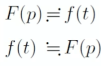

## Laplace变换

###Laplace积分

$$
\int_0^\infty\mathrm{e}^{-pt}f(t)\mathrm{d}t
$$

称为Laplace积分

+ $t$为实数，$p$是复数，$p=s+i\sigma$
+ $f(t)$的定义域为$t>0$
+ 也可理解为$t<0$时，$f(t)=0$
+ 积分值为$p$的函数，记为$F(t)$

定义
$$
\eta(t)=\begin{cases}1&\quad t>0\\0&\quad t<0&\end{cases}
$$
此时$f(t)$应理解为$f(t)\eta(t)$

### Laplace变换

Laplace变换是一种积分变换，他把$f(t)$变换为$F(p)$
$$
F(p)=\int_0^\infty\mathrm{e}^{-pt}f(t)\mathrm{d}t
$$

+ $F(p)$称为$f(t)$的Laplace换式，简称拉式换式
+ $e^{-pt}$是Laplace变换的核
+ Laplace变换存在的条件就是上述积分的收敛条件

#### 规定

$$
f(t)-Laplace变换的原函数\\
F(p)-Laplace变换的像函数
$$

简写记号
$$
\begin{aligned}
F(p)&=\mathscr{L}\{f(t)\}\quad\\
f(t)&=\mathscr{L}^{-1}\{F(p)\}\quad
\end{aligned}
$$
或者

> 这记号甚至打不出来，我们别管他🤣

### Laplace变换存在的充分条件

+ $f(t)$在区间$0 \leq t <\infin$中除了第一类间断点外都是连续的，而且有连续导数，在==任何有限区间==中，这种间断点的数目是有限的 

  > 🤔，在无限区间中实际并无关系

+ $f(t)$由有限的增长指数，即存在正数$M>0$及$s'\geq0$，使对于任意$t$值，$\abs{f(t)}<Me^{s't}$（实际上，只要$t$足够大时存在即可）

  > 如果$s'$存在，它一定并不唯一，$s'$的下确界称为收敛横标，记为$s_0$

## Laplace变换的性质

### 性质一：Laplace变换是一个线性变换

若
$$
F_1(p)=\mathscr{L}\{f_1(t)\} \quad F_2(p)=\mathscr{L}\{f_2(t)\}
$$
则
$$
\alpha_1F_1(p)+\alpha_2F_2(p)=\mathscr{L}\{f_1(t)+f_2(t)\}
$$

### 性质二：Laplace换式的解析性

若$f(t)$满足Laplace变换存在的充分条件，则
$$
|\mathrm{e}^{-pt}f(t)|<M\mathrm{e}^{-(s-s_0)t}\quad s=\operatorname{Re}p
$$
当$s-s_0\geqslant\delta>0$时，
$$
|\mathrm{e}^{-pt}f(t)|<M\mathrm{e}^{-\delta t}
$$
而积分$\int_{0}^{\infty}M\mathrm{e}^{-\delta t}\mathrm{d}t$收敛，故积分$\int_0^\infty\mathrm{e}^{-pt}f(t)\mathrm{d}t$在$\operatorname{\mathrm{Re}}p\geqslant s_{0}+\delta$上一致收敛，因而在$\Re p>s_0$的半平面内代表一个解析函数，即$F(p)$在半平面$\Re p>s_0$内解析

> 可以用该性质确定收敛横标$s_0$

### 性质三

若$f(t)$满足Laplace变换存在的充分条件，则
$$
F(p)\to0\quad\text{当 Re}p=s\to+\infty
$$

### 性质四

设$f(t)$及$f'(t)$都满足Laplace变换存在的充分条件，$f(t)=\mathscr{L}^{-1}\{F(p)\}$，则
$$
f'(t)=\mathscr{L}^{-1}\{pF(p)-f(0)\}
$$

> 对原函数$f(t)$的微商运算转化为对像函数$F(p)$的乘法运算，而且还自动包括了$f(t)$的初值，因此，Laplace变换是求解微分方程的一种重要方法

**推论**

当$f(t),f^{\prime}(t),\cdots,f^{(n)}(t)$均满足Laplace变换存在的充分条件，$f(t)=\mathscr{L}^{-1}\{F(p)\}$，则
$$
\begin{aligned}
&f^{\prime\prime}(t)=\mathscr{L}\{p^{2}F(p)-pf(0)-f^{\prime}(0)\}\\

&f^{(3)}(t)=\mathscr{L}\{p^3F(p)-p^2f(0)-pf^{\prime}(0)-f^{\prime\prime}(0)\}\\

&f^{(n)}(t)=\mathscr{L}\{p^{n}F(p)-p^{n-1}f(0)-p^{n-2}f^{\prime}(0)-\cdots-pf^{(n-2)}(0)-f^{(n-1)}(0)\}
\end{aligned}
$$

> PS，通过简单的积分变换和递推关系，即可证明性质和推论

**例**：求解微分方程
$$
L\frac{di}{dt}+Ri=E\quad i(0)=0\tag{2.1}
$$
首先，令$i(t)=\mathscr{L}^{-1}\{I(p)\}$

对方程$(2.1)$左右两边同时进行Laplace变换，得到
$$
LqI(p)+RI(p)=\frac{E}{p}
$$
可以解得像函数
$$
I(p)=\frac{E}{p}\frac{1}{Lp+R}=\frac{E}{R}\left(\frac{1}{p}-\frac{L}{Lp+R}\right)
$$
反演可得
$$
i(t)=\frac{E}{R}\left[1-e^{-(R/L)t}\right]
$$

> 🤔，这个反演和同时进行Laplace变换是如何保证可行的呢❓

###性质五

 设$f(t)$满足Laplace变换存在的充分条件，则
$$
\int_{0}^{t}f(\tau)d\tau=\mathscr{L}^{-1}\left\{\frac{F(p)}{p}\right\}
$$

> 对原函数$f(t)$的（变上限）积分转化为对像函数$F(p)$的除法
>
> 因此也可以用来求解积分（微分方程）

### 性质六：相似定理

$$
f(at)=\mathscr{L}^{-1}\left\{ \frac{1}{a}F\left(\frac{p}{a}\right) \right\}\quad a>0
$$

### 性质七：延迟定理

$$
f(t-\tau)=\mathscr{L}^{-1}\left\{ e^{-p\tau}F(p) \right\}\quad \tau>0
$$

这里的积分限是$t\in(\tau,\infin)$

> 实际上是$(-\infin,\infin)$，只是考虑到$\eta$函数，在$(-\infin,\tau)$的范围内，$f(x)\equiv0$

### 性质八：位移定理

$$
F(p-p_0)=\mathscr{L}\left\{ e^{p_0t}f(t) \right\}
$$

> Ps,这一串性质可以自己试着用积分变换算一下

## Laplace变换的反演

###唯一性问题

+ 从像函数反过来求原函数的问题称为反演

+ 首先遇到的问题是反演的唯一性问题🤔

  即是否存在$f_1(t),f_2(t)$使得
  $$
  f_1(t)=\mathscr{L}^{-1}\{F(p)\} \quad f_2(t)=\mathscr{L}^{-1}\{F(p)\}\\
  $$
  且
  $$
  f_1(t) \not \equiv f_2(t)
  $$

+ 若限定原函数为连续函数，则Laplace变换的反演具有唯一性
+ 否则Laplace变换的反演不唯一，不同原函数之间相差“零函数”（在若干个点不为0，其余点均为0）

### 存在性问题

$F(p)$作为Laplace变换的像函数，必须满足下面要求：

+ $F(p)$在半平面$\Re p>s_0$内解析（即能够选取$s_0$）

+ $$
  \lim_{\Re p\to\infin}F(p)=0
  $$

+ $F(p)$不可能为周期函数，否则恒为0（这个可以从上面那玩意证明）

### 像函数导数的反演

设$f(t)$满足Laplace变换存在的充分条件，$f(t)=\mathscr{L}^{-1}\{F(p)\}$，则$F(p)$在$\Re p \geq s_1>s_0$的半平面中解析，因而可以在积分号下求导
$$
\begin{aligned}F^{(n)}(p)&=\frac{\mathrm{d}^n}{\mathrm{d}p^n}\int_0^\infty f(t)\mathrm{e}^{-pt}\mathrm{d}t\\&=\int_0^\infty(-t)^nf(t)\mathrm{e}^{-pt}\mathrm{d}t\end{aligned}
$$
所以，
$$
F^{(n)}(p)=\mathscr{L}\{ (-t)^nf(t) \}
$$

> 由此，可以方便的得出
> $$
> \frac{1}{p^n}=\mathscr{L}\{ \frac{1}{(n-1)!}t^{n-1} \}
> $$
> 从而推广到一般有理函数的求解，将一般有理函数化为部分分式和后求解原函数

###像函数积分的反演

若$\int_p^\infty F(q)\mathrm{d}q$存在，且当$t\to 0 $时，$\abs{f(t)/t}$有界，则
$$
\int_{p}^{\infin}F(q)dq=\mathscr{L}\left\{ \frac{f(t)}{t} \right\}\tag{3.1}
$$
考虑到定义域的问题，这里的积分上限为$\Re p\to \infin$并且积分路径在$F(p)$的解析区域内，因而积分与路径无关

> 利用这个公式，又==可以得到许多函数的Laplace变换==
>
> 如
> $$
> \frac{\sin\omega t}{t}=\mathscr{L}^{-1}\left\{\int_p^\infty\frac{\omega}{q^2+\omega^2}\mathrm{d}q\right\}
> =\mathscr{L}^{-1}\left\{\frac{\pi}{2}-\arctan\frac{p}{\omega}\right\}
> $$

特殊情形，若$p\to0$时，式$(3.1)$两端均有意义，则有
$$
\int_0^\infty F(p)\mathrm{d}p=\int_0^\infty\frac{f(t)}{t}\mathrm{d}t
$$
可用于计算特定形式的积分

###卷积定理

设
$$
\left\{
\begin{aligned}
F_1(p)=\mathscr{L}\{f_1(t)\}\\
F_2(p)=\mathscr{L}\{f_2(t)\}
\end{aligned}
\right.
$$
则
$$
F_1(p)F_2(p)=\mathscr{L}^{-1}\left\{ \int_{0}^{t} f_1(\tau)f_2(t-\tau) d\tau \right\}
$$

> PS，证明直接写出积分然后化为二重积分后换元就容易得证
>
> （不过那一堆数学上的前提条件证明忘完了😊）

### 普遍反演公式

若函数$F(p),p=s+i\theta$满足：

+ $F(p)$在区域$\Re p > s_0$中解析
+ 在区域$\Re p> s_0$中，$\abs{p}\to\infin$时，$F(p)$一致趋于$0$
+ 对于所有的$\Re p=s>s_0$，沿直线$L:\Re p=s$的无穷积分$\int_{s-\mathrm{i}\infty}^{s+\mathrm{i}\infty}|F(p)|\mathrm{d}\sigma\quad(s>s_0)$收敛

则对于$\Re p=s>s_0,F(p)$是
$$
f(t)=\frac{1}{2\pi\mathrm{i}}\int_{s-\mathrm{i}\infty}^{s+i\infty}F(p)\mathrm{e}^{pt}\mathrm{d}p
$$
的Laplace变换，其中$t$为实变量

