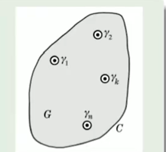
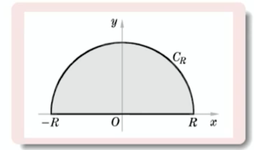
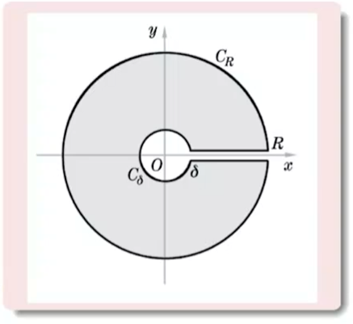

## 留数定理

### 留数的引入

​	对于函数的Laurent展开，可以用

```math
\oint_C\frac{f(\zeta)}{(\zeta - n)^{n+1}}d\zeta=2\pi i a_n
```

计算$a_n$，特别的，当$n = -1$时，有

```math
\oint_C f(\zeta)d\zeta=2\pi i a_{-1}
```

而在某些情况下，$a_{-1}$可能便于求解，这就是留数定理的基本思想

### 留数定理

设区域 $G$ 的边界 $C$ 为一分段光滑的简单闭合曲线. 若除==有限个孤立奇点== $b_k$, $k=1,2,3,\cdots,n$ 外, 函数 $f(z)$ 在 $G$ 内单值解析, 在 $\overline{G}$ 中连续, 且在 $C$ 上没有 $f(z)$ 的奇点,则

```math
\oint_Cf(z)\mathrm{d}z=2\pi\mathrm{i}\sum_{k=1}^n\mathrm{res}f(b_k)
```

$resf(b_k)$称为$f(z)$在$b_k$处的留数，它等于$f(z)$在$b_k$的邻域内Laurent展开中$(z-b_k)^{-1}$的系数$a_{-1}^{(k)}$

> proof.
>
> 
>
> 由Cauchy定理及Laurent展开的系数公式，即得
>
> ```math
> \oint_C f(z) dz = \sum_{k=1}^n \oint_{\gamma_k}f(z) dz =2\pi i \sum_{k=1}^n a_{-1}^{k}=2\pi i \sum_{k=1}^n resf(b_k)
> ```

+ 留数定理告诉我们，解析函数的围道积分值于函数在围道内的奇点直接有关

+ 在极点的情况下，可以通过微商计算留数


###留数的计算

####$z=b$点时$f(z)$的$m$阶极点

在$b$点的邻域内

```math
f(z)=a_{-m}(z-b)^{-m}+\cdots+a_{-1}(z-b)^{-1}+a_{0}+a_{1}(z-b)+a_{2}(z-b)^{2}+\cdots
```

可化为

```math
\begin{aligned}(z-b)^{m}f(z)&=a_{-m}+\cdots+a_{-1}(z-b)^{m-1}+a_{0}(z-b)^{m}\\&+a_1(z-b)^{m+1}+a_2(z-b)^{m+2}+\cdots\end{aligned}
```

进而得到

```math
a_{-1}=\left.\frac{1}{(m-1)!}\frac{\mathrm{d}^{m-1}}{\mathrm{d}z^{m-1}}(z-b)^{m}f(z)\right|_{z=b}
```

> 🤔这种方法似乎也可以用于求$a_{k},k\geq -1$
>
> 🤔似乎利用了（正的）幂级数在$\abs{z-b}<1$时必然收敛

特别的，当$z=b$为一阶极点时

```math
a_{-1}=\lim_{z\to b}(z-b)f(z)
```

此外，一种常见情况：

> $f(z)=\frac{P(z)}{Q(z)}$，且
>
> + $P(z),Q(z)$均在$b$点及其邻域解析，
> + $P(b)\not = 0,Q(b) = 0,Q'(b)\not=0$
>
> 则有：
>
> ```math
> \begin{aligned}a_{-1}&=\lim_{z\to b}(z-b)f(z)\\&=\lim_{z\to b}(z-b)\frac{P(z)}{Q(z)}=\frac{P(b)}{Q^{\prime}(b)}\end{aligned}
> ```
>
> 🤔这玩意好像是挺常见的

 

### 留数定理的基本应用

+ 求解积分

  > 计算积分$\oint_{\abs{z} = n} \tan {\pi z} dz$
  >
  > 该积分奇点与$\cos \pi z$一致，而$\cos z$的奇点均为一阶奇点且这些点的函数值均为$0$
  >
  > ```math
  > 
  > ```

+ 求解部分分式

  > 将
  >
  > ```math
  > f(z)=\frac{1}{(z-1)(z-2)(z-3)}
  > ```
  >
  > 部分分式
  >
  > > ```math
  > > \frac{1}{(z-1)(z-2)(z-3)}=\frac{A}{z-1}+\frac{B}{z-2}+\frac{C}{z-3}
  > > ```
  > >
  > > 可以在每一个奇点附近作圆，==求解围道积分，其值均等于留数==
  > >
  > > ```math
  > > \begin{aligned}&A=\operatorname{res}\frac{1}{(z-1)(z-2)(z-3)}|_{z=1}=\frac{1}{2}\\&B=\operatorname{res}\frac{1}{(z-1)(z-2)(z-3)}|_{z=2}=-1\\&C=\operatorname{res}\frac{1}{(z-1)(z-2)(z-3)}|_{z=1}=\frac{1}{2}\end{aligned}
  > > ```

  > 将
  >
  > ```math
  > f(z)=\frac{1}{(z-1)^2(z-2)(z-3)}
  > ```
  >
  > 部分分式
  >
  > > ```math
  > > \frac{1}{(z-1)^2(z-2)(z-3)}=\frac{A}{(z-1)^2}+\frac{B}{z-1}+\frac{C}{z-2}+\frac{D}{z-3}
  > > ```
  > >
  > > 与上个例子相似，可以得到
  > >
  > > ```math
  > > \begin{align}
  > > A&=\operatorname{res}\frac{1}{(z-1)(z-2)(z-3)}|_{z=1}=\frac{1}{2}\\
  > > B&=\operatorname{res}\frac{1}{(z-1)^{2}(z-2)(z-3)}|_{z=1}=\frac{3}{4}\\
  > > C&=\operatorname{res}\frac{1}{(z-1)^{2}(z-2)(z-3)}|_{z=2}=-1\\
  > > D&=\operatorname{res}\frac{1}{(z-1)^{2}(z-2)(z-3)}|_{z=3}=\frac{1}{4}
  > > \end{align}
  > > ```
  > >
  > > 其中$A$的求解是基于等式两端同时乘以$(z-1)$后得到
  > >
  > > ```math
  > > \frac{1}{(z-1)(z-2)(z-3)}=\frac{A}{z-1}+B+\frac{C(z-1)}{z-2}+\frac{D(z-1)}{z-3}
  > > ```
  > >
  > > 此后再求留数

  🤔和前面介绍的那玩意本质基本一致吧🤔

  + 前面那个是基于等式两端乘以同一个数极限仍然相等
  + 这里是基于等式两端同时进行围道积分仍然相等

  🤔这玩意的局限性似乎有点大

###函数在$\infin$的留数

#### 定义

```math
\operatorname{res}f(\infty)=\frac{1}{2\pi\mathrm{i}}\oint_{C^{\prime}}f(z)\mathrm{d}z
```

+ $C'$是绕$\infin$点正向（即顺时针方向）一周的围道

+ $\infin$点可能是$f(z)$的奇点🤔

  ==因此$resf(\infin)$并不是$f(z)$在$\infin$点邻域内的Laurent展开项中$z^1$的系数==

+ 围道内无其它奇点

#### 特殊性

```math
\mathrm{res}f(\infty)=\frac{1}{2\pi\mathrm{i}}\oint_{C^{\prime}}f(z)\mathrm{d}z=-\frac{1}{2\pi\mathrm{i}}\oint_{C}f\left(\frac{1}{t}\right)\frac{\mathrm{d}t}{t^{2}}
```

由此可得

```math
\begin{align}
resf(\infin)
&=-\frac{f(1/t)}{t^2}\text{在$t=0$点幂级数展开中$t^{-1}$项的系数}\\
&=-f(1/t)\text{在}t=0\text{点幂级数展开中$t^1$项的系数}\\
&=-f(z)\text{在}z=\infty\text{点幂级数展开中$z^{-1}$项的系数}
\end{align}
```

🤔$\infin$的留数来自于正则部分🤔

+ 从概念上来说，$z=\infin$处的留数与$f(\infin)$是否为奇点，为几阶极点等无关

+ 从结果上看，函数$f(z)$在$\infin$点的留数，等于$f(z)$在$\infin$点邻域内幂级数展开中$z^{-1}$项的系数乘以$-1$

+ 从数值上来说，如果$f(z)$在整个复平面上除==有限个孤立奇点==外处处单值解析，则

  ```math
  \operatorname{res}f(\infty)=(-1)\times\text{ 平面内(有限远处)所有奇点的留数和}
  ```

  > 换言之，如果函数$f(z)$在整个复平面上除有限的孤立奇点外处处单值解析，则在扩充的全平面上留数和为$0$

##留数定理计算定积分

基本思想：将（实的）定积分与（复的）围道积分联系起来，将积分的计算转换为留数的计算

###有理三角函数的积分

####有理三角函数

```math
I =\int_{0}^{2\pi} R(\sin \theta , \cos \theta)d\theta
```

其中$R$是$\sin \theta,\cos \theta $的有理函数，==在$[0,2\pi]$上连续==（🤔这里保证了下面变换后在$\abs{z}=1$上无奇点）

####计算方法：

作变换$z=e^{i\theta}$

```math
\sin\theta=\frac{z^2-1}{2\mathrm{i}z}\quad\cos\theta=\frac{z^2+1}{2z}\quad\mathrm{d}\theta=\frac{\mathrm{d}z}{\mathrm{i}z}
```

因此得到

```math
I=\oint_{|z|=1}R\left(\frac{z^2-1}{2\mathrm{i}z},\frac{z^2+1}{2z}\right)\frac{\mathrm{d}z}{\mathrm{i}z}
```

而对于这种函数的围道积分有

> + 利用
>
>   ```math
>   \oint_{\abs{z}=1}z^n = 0(z\not = -1)
>   ```
>
>   🤔不过这玩意本质和留数好像差不多❓
>
> + 在$\abs{z}=1$内的留数
>
> + 在$\abs{z} = \infin$的留数（若在$\abs{z}=1$外无奇点）

### 无穷积分

#### 无穷积分

```math
\int_{-\infty}^{\infty}f(x)\mathrm{d}x=\lim_{\begin{array}{l}R_1\to+\infty\\R_2\to+\infty\end{array}}\int_{-R_1}^{R_2}f(x)\mathrm{d}x
```

此外，若$\operatorname*{lim}_{R\to+\infty}\int_{-R}^{R}f(x)\mathrm{d}x$存在，则有积分主值，记为

```math
\mathrm{v.p.}\int_{-\infty}^{\infty}f(x)\mathrm{d}x=\operatorname*{lim}_{R\to+\infty}\int_{-R}^{R}f(x)\mathrm{d}x
```

#### 计算方法：

解析延拓后构建环道，计算环道积分和环道内留数

核心是在无穷远处构建==合适路径==，使得辅助路径的积分易于求解或==与实轴上的积分有关联==

常见方法为构建上半圆弧或下半圆弧（🤔这玩意算的实际上是主值积分，但无穷积分存在时主值与之相等）

> 
>
> ```math
> \begin{align}
> \oint_Cf(z)\mathrm{d}z
> &=\int_{-R}^Rf(x)\mathrm{d}x+\int_{C_R}f(z)\mathrm{d}z\\
> &=2\pi i\sum_{\text{上半平面}}\text{res} f(z)
> \end{align}
> ```
>
> 取极限，由此得到
>
> ```math
> \int_{-\infin}^{\infin}f(x)dx = 2\pi i\sum_{\text{上半平面}}\text{res} f(z)
> ```

条件：

+ $f(z)$在上半平面除了有限个孤立奇点外处处解析，在实轴上没有奇点
+ 在$0\leq \arg z \leq \pi$范围内，当$\abs{z}\to \infin$时，$zf(z)$一致地趋于$0$（这里是利用大圆弧引理）

#### 例题🤔（还算好玩的一种思路）

> + 计算积分
>
>   ```math
>   \int_0^\infty\frac{1}{1+x^4}\mathrm{d}x\tag1
>   ```
>
>   ```math
>   \int_0^\infty\frac{1}{1+x^{100}}\mathrm{d}x\tag2
>   ```
>
>   ```math
>   \int_0^\infty\frac{1}{1+x^3}\mathrm{d}x\tag3
>   ```
>
>   分别使用$1/4,1/100,1/3$个圆弧进行计算，这样就只需要计算一个奇点
>
>   > 🤔核心
>   >
>   > + 正实轴上没有奇点，这保证了$1/n$个圆弧的边界上不会出现奇点，且圆弧内必定只有一个奇点🤔
>   >
>   >   不过到后面瑕积分那这个似乎也可以解决🤔
>   >
>   > + $1/n$个圆弧上的$z^n=x^n$，此时就将两个半径上的积分统一成
>   >
>   >   ```math
>   >   (1+e^{2\pi i/n})\int_{0}^{\infin}f(x)dx
>   >   ```

### 含三角函数的无穷积分

#### 含三角函数的无穷积分

不妨设$p>0$

```math
I=\int_{-\infty}^{\infty}f(x)\cos px\mathrm{d}x\quad\text{或}\quad I=\int_{-\infty}^{\infty}f(x)\sin px\mathrm{d}x
```

#### 求解方法1：

+ 传统作法是将被积函数取为$f(z)e^{ipz}$

+ 若函数$f(z)e^{ipz}$在上半平面内只有有限个奇点，则

  ```math
  \begin{aligned}\oint_Cf(z)\mathrm{e}^{\mathrm{i}pz}\mathrm{d}z
  &=\int_{-R}^Rf(x)\mathrm{e}^{\mathrm{i}px}\mathrm{d}x+\int_{C_R}f(z)\mathrm{e}^{\mathrm{i}pz}\mathrm{d}z\\&=2\pi\mathrm{i}\sum_\text{上半平面}{\mathrm{res}\left\{f(z)\mathrm{e}^{\mathrm{i}pz}\right\}}\end{aligned}
  ```

  此时，若能求出$\int_{C_R}f(z)\mathrm{e}^{\mathrm{i}pz}\mathrm{d}z$，则可以通过

  ```math
  \int_{-R}^Rf(x)\mathrm{e}^{\mathrm{i}px}\mathrm{d}x
  =\int_{-\infty}^\infty f(x)\cos px\mathrm{d}x+i\int_{-\infty}^\infty f(x)\sin px\mathrm{d}x
  ```

  得出待计算函数积分

  为处理

  ```math
  \int_{C_R}f(z)e^{ipz}dz
  ```

  引入Jordan引理

#### Jordan引理

设在$0 \leq \arg z \leq \pi$范围内，$\abs{z} \to \infin$时，$Q(z)\rightrightarrows 0$，则

```math
\lim_{R\to\infty}\int_{C_{R}}Q(z)\mathrm{e}^{\mathrm{i}pz}\mathrm{d}z=0
```

其中$p>0$，$C_R$是以原点为圆心，$R$为半径的上半圆（ps，很容易将该结论推广至任意圆弧）

> proof.
>
> ```math
> \begin{aligned}
> \left|\int_{C_{R}}Q(z)\mathrm{e}^{\mathrm{i}pz}\mathrm{d}z\right|
> 
> &=\left|\int_{0}^{\pi}Q(R\mathrm{e}^{\mathrm{i}\theta})\mathrm{e}^{\mathrm{i}pR(\cos\theta+\mathrm{i}\sin\theta)}R\mathrm{e}^{\mathrm{i}\theta}\mathrm{i}\mathrm{d}\theta\right|\\
> 
> &\leqslant\int_0^\pi\left|Q(R\mathrm{e}^{\mathrm{i}\theta})\right|\mathrm{e}^{-pR\sin\theta}R\mathrm{d}\theta
> \end{aligned}
> ```
>
> > ps.这个小于等于是由于
> >
> > ```math
> > e^{ix} \leq 1
> > ```
> >
> > $x$为实数
>
> 由此得到
>
> ```math
> \begin{align}
> \left|\int_{C_{R}}Q(z)\mathrm{e}^{\mathrm{i}pz}\mathrm{d}z\right|
> &\leqslant\int_{0}^{\pi}\left|Q(R\mathrm{e}^{\mathrm{i}\theta})\right|\mathrm{e}^{-pR\sin\theta}R\mathrm{d}\theta\\
> &\leqslant\varepsilon R\int_{0}^{\pi}\mathrm{e}^{-pR\sin\theta}\mathrm{d}\theta\\
> &=2\varepsilon R\int_{0}^{\pi/2}\mathrm{e}^{-pR\sin\theta}\mathrm{d}\theta
> \end{align}
> ```
>
> > 🤔我的想法是对任意$R$取$\Delta \theta$，使得$e^{ipR\sin\Delta\theta}\to e^{ipR\Delta\theta}$然后对于其它部分利用$R\to \infin$求解，不过想了下好像有点问题🤔得想办法把$R\to\infin$与$\Delta \theta \to 0$统一起来🤔
> >
> > 它这直接用$\leq$比这想法确实好很多🤔
>
> 由于
>
> ```math
> \sin \theta \leq \frac{2\theta}{\pi},(0\leq \theta \leq \frac{\pi}{2})
> ```
>
> 由此得到
>
> ```math
> \begin{aligned}
> \left|\int_{C_{R}}Q(z)\mathrm{e}^{\mathrm{i}pz}\mathrm{d}z\right|
> &\leqslant2\varepsilon R\int_{0}^{\pi/2}\mathrm{e}^{-pR\operatorname{sin}\theta}\mathrm{d}\theta\\
> &\leqslant2\varepsilon R\int_{0}^{\pi/2}\mathrm{e}^{-pR\cdot2\theta/\pi}\mathrm{d}\theta\\
> &=2\varepsilon R\cdot\frac{\pi}{2pR}\left(1-\mathrm{e}^{-pR}\right)
> \end{aligned}
> ```
>
> 由此得证

#### 求解方法2：

以

```math
\int_{-\infin}^{\infin}f(x)\cos px dx
```

为例

若该函数在上半平面仅有有限个奇点，则

```math
\begin{aligned}
\oint_Cf(z)\cos pz\mathrm{d}z
&=\int_{-R}^Rf(x)\cos px\mathrm{d}x+\frac{1}{2}\int_{C_R}f(z)\left(\mathrm{e}^{\mathrm{i}pz}+\mathrm{e}^{-\mathrm{i}pz}\right)\mathrm{d}z\\
&=2\pi\mathrm{i}\sum_\text{上半平面}{\mathrm{res~}\{f(z)\cos pz\}}
\end{aligned}
```

若满足Jordan引理，则只需要计算

```math
\operatorname*{lim}_{R\to\infty}\int_{C_{R}}f(z)\mathrm{e}^{-\mathrm{i}pz}\mathrm{d}z
```

而根据Jordan引理，有引理

> 设函数$Q(z)$只有有限个奇点，且在==下半平面==的范围内，当$\abs{z}\to \infin$是一致地趋近于$0$，则
>
> ```math
> \begin{gathered}
> \begin{aligned}
> \lim_{R\to\infty}\int_{C_{R}}Q(z)\mathrm{e}^{-\mathrm{i}pz}\mathrm{d}z
> \end{aligned}\\=2\pi\mathrm{i}\times\sum_\text{全平面}{\mathrm{res}}\left\{Q(z)\mathrm{e}^{-\mathrm{i}pz}\right\}\\=-2\pi\mathrm{i}\times\mathrm{res}\left\{Q(z)\mathrm{e}^{-\mathrm{i}pz}\right\}_{z=\infty}
> \end{gathered}
> ```
>
> 其中$p>0,C_R$是以原点为圆心、$R$为半径的半圆弧，位于上半平面
>
> > proof.
> >
> > 令$C_R'$为绕下半平面的圆弧，则由
> >
> > ```math
> > \begin{align}
> > \lim_{R\to\infin}\int_{C_R'}Q(z)e^{-ipz}dz
> > &=\lim_{R\to\infin}\int_{C_R}Q(-z)e^{ipz}dz\\
> > &=0
> > \end{align}
> > ```
> >
> > 可以得到
> >
> > ```math
> > \begin{align}
> > \lim_{R\to\infty}\int_{C_{R}}Q(z)\mathrm{e}^{-\mathrm{i}pz}\mathrm{d}z=2\pi\mathrm{i}\times\sum_\text{全平面}{\mathrm{res}}\left\{Q(z)\mathrm{e}^{-\mathrm{i}pz}\right\}-\int_{C_R'}Q(z)e^{-ipz}dz
> > \end{align}
> > ```
> >
> > 两边同时对$R$取极限就可以得到结论

### 积分路径上有奇点的积分

#### 瑕积分

```math
\int_{a}^{b}f(x)\mathrm{d}x=\lim_{\delta_{1}\to0}\int_{a}^{c-\delta_{1}}f(x)\mathrm{d}x+\lim_{\delta_{2}\to0}\int_{c+\delta_{2}}^{b}f(x)\mathrm{d}x
```

其中$c$点为瑕点，此外，称

```math
\mathrm{v.p.}\int_a^bf(x)\mathrm{d}x=\lim_{\delta\to0}\left[\int_a^{c-\delta}f(x)\mathrm{d}x+\int_{c+\delta}^bf(x)\mathrm{d}x\right]
```

为瑕积分的主值

同理，若瑕积分与主值同样存在，则二者相等

#### 计算方法

核心是基于==小圆弧引理==处理瑕点处小圆弧（🤔圆弧上的一个小圆弧圆周角应该是$\pi$吧🤔）

注意小圆弧的方向（顺时针和逆时针）以及小圆弧的构造是否使得奇点被包含🤔

### 多值函数的积分

注意这部分的计算需要首先规定单值分支，并保证奇点辐角的选取同样在单值分支内

####含幂函数的积分

```math
I=\int_{0}^{\infty}x^{s-1}Q(x)\mathrm{d}x
```

其中$s$为实数，==$Q(z)$单值==，在正实轴上无奇点为了保证积分收敛，要求

```math
\lim_{x\to\infty}x\cdot x^{s-1}Q(x)=\lim_{x\to0}x\cdot x^{s-1}Q(x)=0
```

由于$z=0$和$z=\infin$是被奇函数的分支点，因此需要将平面沿正实轴割开，并规定割线上岸$\arg z=0$（🤔最后得出结果与上岸规定无关）由此作出积分围道



此时

```math
\oint_{C}z^{s-1}Q(z)\mathrm{d}z=\int_{\delta}^{R}x^{s-1}Q(x)\mathrm{d}x+\int_{R}^{\delta}(x\mathrm{e}^{2\pi\mathrm{i}})^{s-1}Q(x)\mathrm{d}x+\int_{C_{R}}z^{s-1}Q(z)\mathrm{d}z+\int_{C_{\delta}}z^{s-1}Q(z)\mathrm{d}z
```

如果

+ 在$0 \leq \arg z \leq 2\pi$的范围内

  ```math
  \lim_{z\to\infty}z^sQ(z)=0\quad\lim_{z\to0}z^sQ(z)=0
  ```

  则由大圆弧引理和小圆弧引理，有

  ```math
  \lim_{R\to\infty}\int_{C_R}z^{s-1}Q(z)\mathrm{d}z=\lim_{\delta\to0}\int_{C_\delta}z^{s-1}Q(z)\mathrm{d}z=0
  ```

+ 如果$Q(z)$在全平面上除了有限个孤立奇点(不在正实轴上)外，是单值解析的，因而可以应用留数定理

由此，可以得到

```math
\left(1-\mathrm{e}^{2\pi\mathrm{i}s}\right)\int_0^\infty x^{s-1}Q(x)\mathrm{d}x=2\pi\mathrm{i}\sum_\text{全平面}{\mathrm{res}}\left\{z^{s-1}Q(z)\right\}
```

化简，得到

```math
\int_0^\infty x^{s-1}Q(x)\mathrm{d}x=\frac{2\pi\mathrm{i}}{1-\mathrm{e}^{2\pi\mathrm{i}s}}\sum_\text{全平面}\mathrm{res}\left\{z^{s-1}Q(z)\right\}
```

> 🤔这算出来的是什么玩意，我不是在算实函数的积分吗❓，为什么不能只用第一象限🤔（虽说这个作法也挺好玩🤔）

####含对数函数的积分

```math
I=\int_{0}^{\infty}Q(x)\ln x\mathrm{d}x
```

其中$Q(x)$单值，在正实轴上没有奇点，为保证积分收敛，要求

```math
\lim_{x\to\infty}x\cdot Q(x)\ln x=\lim_{x\to0}x\cdot Q(x)\ln x=0
```

> 由于
>
> ```math
> \ln z = \ln x + 2k\pi i
> ```
>
> 能够得到
>
> ```math
> \begin{aligned}\oint_CQ(z)\operatorname{ln}z\mathrm{d}z&=\int_{\delta}^{R}Q(x)\operatorname{ln}x\mathrm{d}x+\int_{R}^{\delta}Q(x)[\operatorname{ln}x+2\pi\mathrm{i}]\mathrm{d}x\\&+\int_{C_{R}}Q(z)\ln z\mathrm{d}z+\int_{C_{\delta}}Q(z)\ln z\mathrm{d}z\\&=-2\pi\mathrm{i}\int_{\delta}^{R}Q(x)\mathrm{d}x\\&+\int_{C}Q(z)\operatorname{ln}z\mathrm{d}z+\int_{C}Q(z)\operatorname{ln}z\mathrm{d}z\end{aligned}
> ```
>
> 这不失为一种求解
>
> ```math
> \int_{\delta}^{R}Q(x)\mathrm{d}x
> ```
>
> 的方法，但显然不适用于此处，但根据这个想消的结构，我们可以得到
>
> ```math
> \oint_C Q(x)\ln^{n} xdx
> ```
>
> 的递推求解方法

此处考虑

```math
\oint_C Q(z) \ln^2 z dz
```

化开后化简可得

```math
\oint_CQ(z)\ln^2z\mathrm{d}z=-4\pi\mathrm{i}\int_{\delta}^{R}Q(x)\ln x\mathrm{d}x+4\pi^{2}\int_{\delta}^{R}Q(x)\mathrm{d}x+\int_{C_{B}}Q(z)\ln^{2}z\mathrm{d}z+\int_{C_{s}}Q(z)\ln^{2}z\mathrm{d}z
```

> 喵的，怎么和那个$\sum_{n=1}^\infin n^k$差不多🤯

如果此时

+ 在$0 \leq \arg z \leq 2\pi$的范围内

  ```math
  \lim_{z\to\infty}z\cdot Q(z)\ln^2z=0\quad\lim_{z\to0}z\cdot Q(z)\ln^2z=0
  ```

+ 如果$Q(z)$在全平面上除了有限个孤立奇点（不在正实轴上）外，是单值解析的，因而可以应用留数定理

取极限后就能得到

```math
-4\pi\mathrm{i}\int_{0}^{\infty}Q(x)\ln x\mathrm{d}x+4\pi^{2}\int_{0}^{\infty}Q(x)\mathrm{d}x=2\pi\mathrm{i}\sum_{\text{全平面}}\mathrm{res}\left\{Q(z)\ln z\right\}
```

进而得到

```math
\int_{0}^{\infty}Q(x)\ln x\mathrm{d}x=-\frac{1}{2}\mathrm{Re}\left\{\sum_{\text{全平面}}\mathrm{res}\left[Q(z)\ln^2 z\right]\right\}\\

\int_{0}^{\infty}Q(x)\mathrm{d}x=-\frac{1}{2\pi}\mathrm{Im}\left\{\sum_{\text{全平面}}\mathrm{res}\left[Q(z)\ln^2 z\right]\right\}
```

> 🤔出书的人表示在满足某些条件时似乎可以在后面乘上$x^s$，后令$s\to 0$计算
