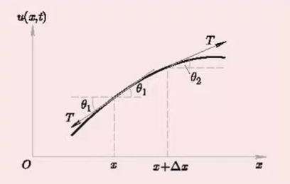
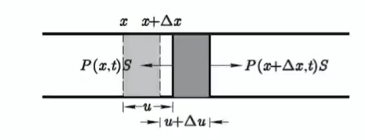

##弦的横震动方程

### 物理问题

有一个==完全柔软==的均匀弦，沿水平方向==绷紧==，而后以某种方法激发，使弦在同一个平面上作==小振动==，列出弦的横震动方程

###分析

取弦的平衡位置为$x$轴，端点坐标为$x=0,x=l$，设$u(x,t)$实际坐标为$x$的弦上一点在$t$时刻的（横向位移），通过分析小弦元($\Delta x$)的张力作用来构建方程

小振动近似：$x+\Delta x$与$x$两点间任一时刻横向位移之差$u(x+\Delta x,t)-u(x,t)$，与$\Delta x$相比是一个小量，即
$$
\abs{\frac{\part u}{\part x}}\ll1
$$

### 方程构建

因为弦式是==完全柔软==的，故只受切向应力—张力$T$的作用，而无法向应力，同时，略去重力作用，因此有
$$
\begin{align}
\Delta m\frac{\part^2 u}{\part t^2}&=(T\sin\theta)_{x+\Delta x}-(T\sin\theta)_{x}
\\
0&=(T\cos\theta)_{x+\Delta x}-(T\cos\theta)_{x}
\end{align}
$$
考虑到小振动近似条件
$$
\left\{
\begin{aligned}
\cos\theta &\approx 1\\
\sin\theta &\approx\tan\theta
\end{aligned}
\right.
$$

> 可以通过泰勒展开，忽略$\tan x$高次项得到
>
> 🤔❓有一说一，这些乱七八糟忽略不影响结果还是不清楚怎么证明

由此得到：
$$
\left\{
\begin{aligned}
T_{x+\Delta x}&=T_{x}=T\\
\Delta m\frac{\part^2 u}{\part t^2}&=T\left[\left(\frac{\part u}{\part x}\right)_{x+\Delta x}-\left(\frac{\part u}{\part x}\right)_{x}\right]
\end{aligned}
\right.
$$
设弦密度
$$
\rho=\frac{dm}{dx}
$$
则：
$$
\rho\frac{\partial^2u}{\partial t^2}=T\frac{\partial^2u}{\partial x^2}
$$
而在小振动条件下，弦元的伸长量为：
$$
\begin{aligned}
\Delta s-\Delta x&=\sqrt{\Delta u^2+\Delta x^2}-\Delta x\\
&=\left[\sqrt{1+\left(\frac{\part u}{\part x}\right)^2}-1\right]\Delta x\\\
&=O\left(\left(\frac{\part u}{\part x}\right)^2\right)
\end{aligned}
$$
弦元长度不变，由Hooke定律，$T$也不随$t$变化

> 🤔，$T$源于一个微扰，但此后保持不变🤔

定义
$$
a=\sqrt{T/\rho}
$$
则方程可以改写为
$$
\frac{\partial^2u}{\partial t^2}-a^2\frac{\partial^2u}{\partial x^2}=0
$$
$a$就是弦振动的传播速率

设单位长度所受外力为$f$，则增添外力后方程可改写为：
$$
\frac{\partial^2u}{\partial t^2}-a^2\frac{\partial^2u}{\partial x^2}=\frac{f}{\rho}
$$
非齐次项$f/\rho$为单位质量所受到的外力

##杆的纵振动方程

### 问题

考虑一均匀细杆，沿杆长方向作小振动。

### 分析

同样的，我们通过考虑$x$处的一个小杆元$\Delta x$的情形，进而转化为微分方程

假设$x$处质点在$t$时刻偏离平衡位置的位移为$u(x,t)$，假设杆的面积为$S$，假设单位面积内杆受到的力为$P(x,t)$

### 方程构建

$$
\rho S\Delta x\overline{\frac{\part^2 u}{\part t^2}}=[P(x+\Delta x,t)-P(x,t)]S
$$

其中
$$
\overline{\frac{\part^2 u}{\part t^2}}
$$
为这一小段的平均加速度

令$\lim_{\Delta x\to 0}$，并化简则得出
$$
\rho \overline{\frac{\part^2 u}{\part t^2}}=\frac{\part P}{\part x}
$$
忽略杆的纵向变化，考虑Hooke定律，则
$$
\left.P\right|_{x}=E\frac{\part u}{\part x}
$$
系数$E$称为杆的Young模量，是一个物质常数

由此可得：
$$
\frac{\partial^2u}{\partial t^2}-a^2\frac{\partial^2u}{\partial x^2}=0
$$
其中
$$
a=\sqrt{\frac{E}{\rho}}
$$

## 波动方程

上面得到的形式相似的一类方程统称为波动方程

更一般的，三维空间中的波动方程是
$$
\frac{\partial^2u}{\partial t^2}-a^2\left(\frac{\partial^2u}{\partial x^2}+\frac{\partial^2u}{\partial y^2}+\frac{\partial^2u}{\partial z^2}\right)=0
$$
定义Laplace算符
$$
\nabla^2=\frac{\partial^2u}{\partial x^2}+\frac{\partial^2u}{\partial y^2}+\frac{\partial^2u}{\partial z^2}
$$

> PS，此处波在空间中的传播具有各项同性，速率一致，因而可以如此表示