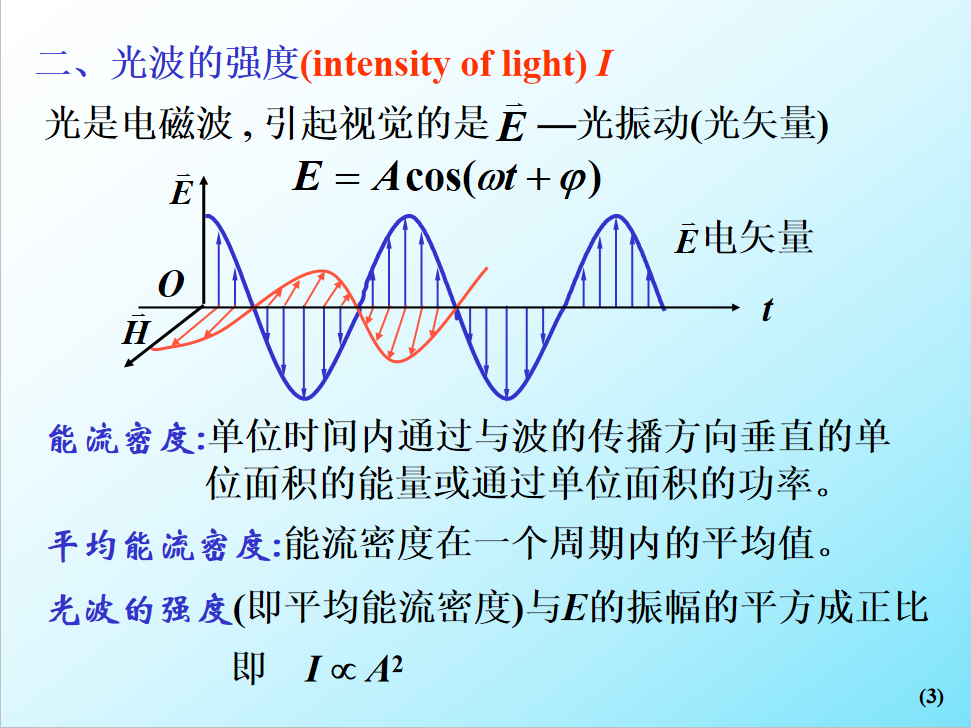
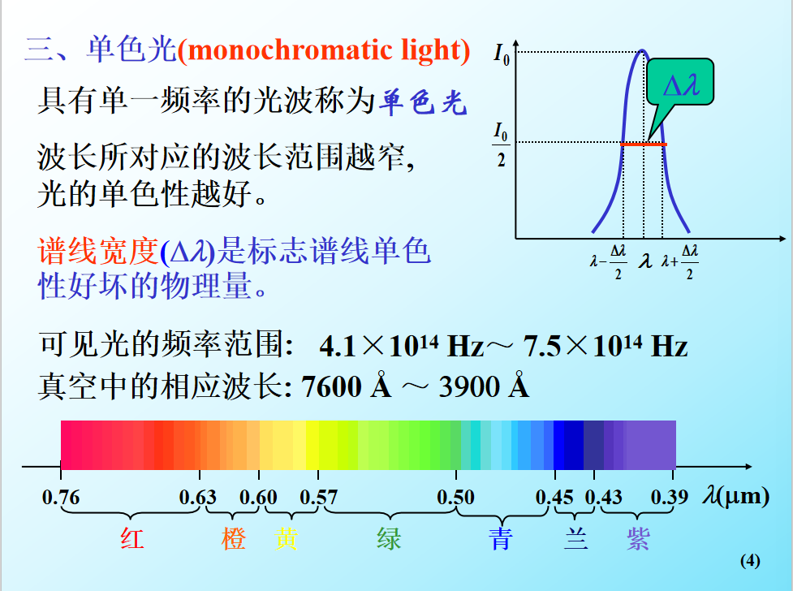
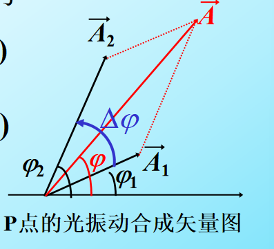
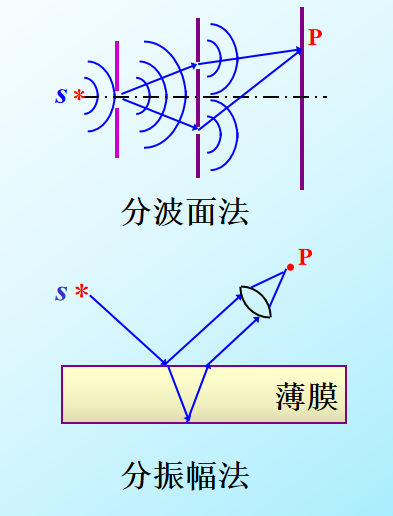
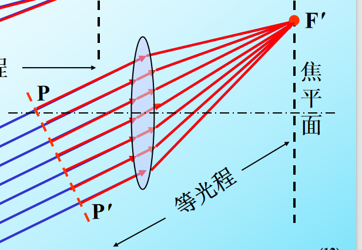
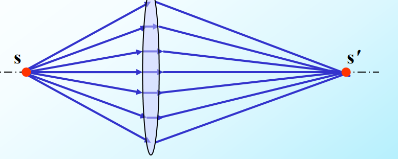
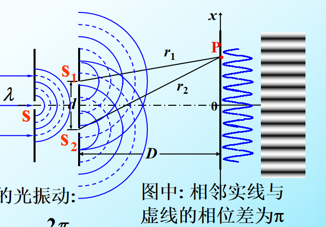

### $\S1.1$ 光源 光的相干性

普通光源发光特点：

> 1. 自发辐射
> 2. 每一次发光持续时间很短（$\tau < 10^{-8}$） ，不同原子或同一原子不同时间发光不相干

#### 光强 $I$

#### 单色光

#### 光的相干性

现有两光波
\[
E_1=A_1\cos(\omega_1t-\frac{2\pi r_1}{\lambda_1})+\varphi_{01})\\E_2=A_2\cos(\omega_2t-\frac{2\pi r_2}{\lambda_2}+\varphi_{02})
\]
在 $P$ 点相遇，可以用矢量图方便表示其振动

得到合振动振幅与光强的表达式
\[
A^2=A_1^2+A_2^2+2A_1A_2\cos(\Delta\varphi)\\
I=I_1+I_2+2\sqrt{I_1I_2}\cos(\Delta\varphi)
\]
其中含有 $\cos$ 的称为干涉项

长时间平均下，若 $\Delta \varphi$ 变化，则 $\cos(\Delta\varphi)$ 被消去，有
\[
\bar{I}=I_1+I_2
\]
即==非相干广干涉的叠加就等于两光光强的简单叠加==

若 $\cos$ 恒定，则能够观察到干涉现象
\[
\bar{I}=I_1+I_2+2\sqrt{I_1I_2}\cos(\Delta\varphi)
\]
考虑到原子激发发光时长很短，我们通常通过下面方法，使得同一原子发出的光变成多束光后叠加形成干涉

==事实上，这也产生了别的问题，如果两束光到达点 $P$ 的时间差与原子一次发光的时长接近，则显然，来自同一原子的光产生干涉的时长相对其发光时长较短==

### $\S1.2 $ 光程差与干涉图样

**光程（optical path）** $x=nr$

**光程差(optical path difference)** $\delta = n_2r_2-n_1r_1$ 

==透镜不会改变光程差== 

### $\S1.3$ 分波阵面的干涉—杨氏双缝干涉

#### 实验示意图

==$D>>d$==
\[
\delta \approx d\sin\theta\approx d\frac{x}{D}
\]
因此得到相邻明/暗条纹的间距为
\[
\Delta x=\frac{D}{d}\lambda
\]
进而求得

\[
\left\{ \begin{aligned}
  &x = k\frac{D}{d}\lambda &\text{明纹中心} \hfill \\
  &x = \left( {2k - 1} \right)\frac{D}{d}\frac{\lambda }{2} &\text{暗纹中心}\hfill \\ 
\end{aligned}  \right.
\]
此外，屏上任意一点的光强为：
\[
\bar{I}=2I_0[1+\cos(\Delta\varphi)]=4I_0\cos^2\frac{\Delta\varphi}{2}
\]

> 这玩意倒不难推，只是一般不管这个

#### 洛埃德镜

