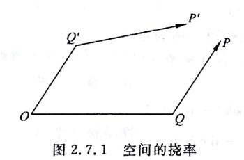
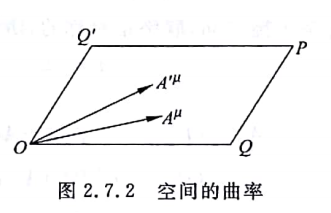

### $\S1 $ 曲率张量&挠率张量

对于一个给定的协变矢量场 $A_\lambda(x)$ 求两次微商，可以得到：
$$
\begin{aligned}A_{\lambda;\mu;\nu}&=A_{\lambda;\mu,\nu}-\Gamma_{\lambda\nu}^{\rho}A_{\rho;\mu}-\Gamma_{\mu\nu}^{\rho}A_{\lambda;\rho}
\\
&=A_{\lambda,\mu,\nu}-\Gamma_{\lambda\mu,\nu}^{\rho}A_{\rho}-\Gamma_{\lambda\mu}^{\rho}A_{\rho,\nu}-\Gamma_{\lambda\nu}^{\rho}A_{\rho,\mu}+\Gamma_{\lambda\nu}^{\rho}\Gamma_{\rho\mu}^{\sigma}A_{\sigma}-\Gamma_{\mu\nu}^{\rho}A_{\lambda;\rho}\end{aligned}\tag{2.7.1}
$$

> 关于协变矢量场的微商为张量，这件事我没验证过，习题那边有个逆变的，估计差不多，我懒得算了
>
> 😡😡😡

交换微商顺序，有
$$
A_{\lambda;\nu;\mu}=A_{\lambda,\nu,\mu}-\Gamma_{\lambda\nu,\mu}^{\rho}A_{\rho}-\Gamma_{\lambda\nu}^{\rho}A_{\rho,\mu}-\Gamma_{\lambda\mu}^{\rho}A_{\rho,\nu}+\Gamma_{\lambda\mu}^{\rho}\Gamma_{\rho\nu}^{\sigma}A_{\sigma}-\Gamma_{\nu\mu}^{\rho}A_{\lambda;\rho}\tag{2.7.2}
$$
两式相减，得到
$$
A_{\lambda;\mu;\nu}-A_{\lambda;\nu;\mu}=R_{\lambda\mu\nu}^{\rho}A_{\rho}-2\Gamma_{[\mu\nu]}^{\rho}A_{\lambda_{1}\rho}\tag{2.7.3}
$$
其中
$$
R_{\lambda\mu\nu}^{\rho}\equiv\Gamma_{\lambda\nu,\mu}^{\rho}-\Gamma_{\lambda\mu,\nu}^{\rho}+\Gamma_{\sigma\mu}^{\rho}\Gamma_{\lambda\nu}^{\sigma}-\Gamma_{\sigma\nu}^{\rho}\Gamma_{\lambda\mu}^{\sigma}\tag{2.7.4}
$$
联络的反对称部分
$$
\Gamma_{[\mu\nu]}^{\rho}=\frac{1}{2}(\Gamma_{\mu\nu}^{\rho}-\Gamma_{\nu\mu}^{\rho})\tag{2.7.5}
$$
称为挠率张量

考虑到 $(2.7.3)$ 左边以及右边第二项均为张量 $R_{\lambda\mu\nu}^{\rho}$ 也必然为张量，我们称之为曲率张量

### $\S 2$ 挠率和曲率的几何性质

> 我们忽略具体的计算过程，这些玩意实在过于繁杂和无聊😡😡😡
>
> 感兴趣的可以自己算一下，反正也就是简单的计算😡😡😡

#### 挠率：

我们假定 $O$ 点处有两个无穷小矢量 $dx^\mu$ 和 $\delta x^\mu$ 分别用 $OQ'$ 和 $OQ$ 表示，考虑将 $\delta x^\mu$ 平移至 $Q'$ 点得到向量 $Q'P'$ 并将 $dx^\mu$ 平移至 $Q$ 点得到向量 $QP$ 

我们能够得到
$$
\eqalign{
  & \Delta  = OP - OP'  \cr 
  &  = \left( {OQ + QP} \right) - \left( {OQ' + Q'P'} \right)  \cr 
  &  = 2\Gamma _{[\nu \lambda ]}^\mu \delta {x^\nu }d{x^\lambda } \cr}\tag{2.7.6}
$$
其中 $$\Gamma _{[\nu \lambda ]}^\mu $$ 为挠率张量，可见，只有当挠率为 $0$ 时，上述操作才能构成一个闭合的平行四边形

> 🤔有意思的是，这玩意还真只与挠率有关

#### 曲率：

我们考虑无挠空间，则上述平行四边形能够闭合

我们考虑一个矢量 $A^\mu$ 令其从 $O$ 出发，沿着 $O\to Q\to P\to Q'\to O$ 的顺序一周得到矢量 $A'^\mu$ 考虑到联络的存在，二者之间很可能存在一个增量 $\delta A^\mu$ 

经过计算，我们能够得到
$$
\delta {A^\mu } =  - R_{\lambda \nu \gamma }^\mu {A^\lambda }\delta {x^\nu }d{x^\gamma }\tag{2.7.7}
$$
其中
$$
R_{\lambda \nu \gamma }^\mu  = \Gamma _{\lambda \gamma ,\nu }^\mu  - \Gamma _{\lambda \nu ,\gamma }^\mu  + \Gamma _{\sigma \nu }^\mu \Gamma _{\lambda \gamma }^\sigma  - \Gamma _{\sigma \gamma }^\mu \Gamma _{\lambda \nu }^\sigma \tag{2.7.8}
$$
就是曲率张量

当对于曲率张量不为 $0$ 的空间，任意一个逆变矢量沿无穷小闭合回路平移一周都不与原矢量重合

 

### $\S3$ 空间的平直性

可以证明一件事：对于挠率和去路都为零的空间，一定可以找到一个坐标系，使得联络的所有分量在这个坐标系中都是零，此时曲率与挠率自然也都是零

我们称曲率不为零的空间是弯曲的，挠率不为零的空间是扭曲的

对于平直空间，在我们选取不同坐标系时，可能出现联络不为零的情况，但无论如何，挠率和曲率必然为零，不依赖于坐标系的选择。

平直时空仅意味着我们可以找到一个联络所有分量均为零的坐标系

> PS，我们物理实际中的联络与数学中还是有区别，不能真的任意选取，需要满足度规、空间实际性质等条件，如：
>
> 理论来说，我们可以赋予平直空间任意联络，但具体到实际中，我们很显然要求联络只能所有分量均为零

### $\S4$ 曲率张量的两个性质

1. 曲率张量后一对指标是反对称的
   $$
   R_{\lambda \nu \gamma }^\mu=-R_{\lambda \gamma \nu }^\mu\tag{2.7.9}
   $$

2. 曲率张量只有两种独立的缩并方式
   $$
   \left\{
   \begin{aligned}
   {A_{\mu \nu }} = R_{\lambda \mu \nu }^\lambda \\
   {R_{\mu \nu }} = R_{\mu \lambda \nu }^\lambda 
   \end{aligned}
   \right.\tag{2.7.10}
   $$
   其余情况很容易证明与该二者重复或等于 $0$

