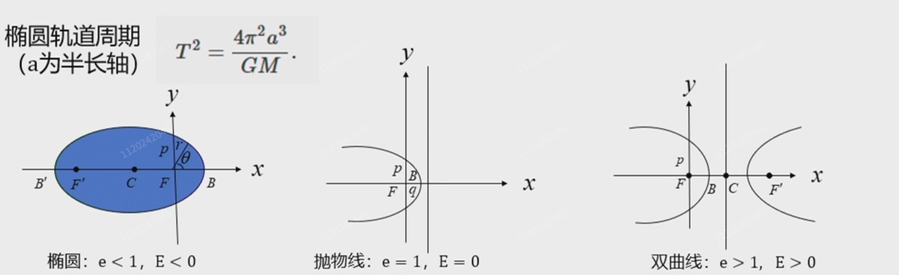
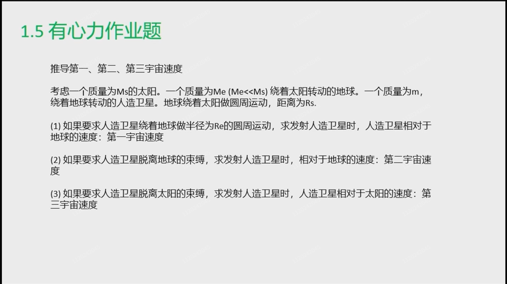

1. 抛物线
   \[
   x^2=2py
   \]
   的焦点和准线分别为
   \[
   P(0,\frac{p}{2})\quad y=-\frac{p}{2}
   \]
   抛物线上的点与焦点的连线和到准线的垂线的平分线为该点的切线

   可以联系其光学性质得到

   > 🤔，确实挺神奇的，
   >
   > 根据波动光学，按照惠更斯原理，当光从去穷远处入射时，若曲面为抛物线，则必然会在焦点处形成亮斑；
   >
   > 而根据几何光学，这个亮斑必定是这无数条平行光线的反射汇聚的点，而入射光与反射光的平分线为该点切线的垂线，因而就得出了这个结论🤔

2. 曲率半径
   \[
   R=\frac{(1+y'^2)^{3/2}}{\abs {y''}}
   \]

3. 极坐标系下的椭圆，双曲线，抛物线的统一表示
   \[
   r=\frac{p}{1+e\cos\theta}
   \]
   $p$ 为正交弦长的一半，$e$ 为偏心率

   

   这就是有心平方反比力的轨道，对于绕中心天体运动的物体，其总能量为
   \[
   E = T + V = \left\{ \begin{gathered}
      - \frac{{GMm}}{{2a}}\quad 0 < e < 1 \hfill \\
     0\quad e = 1 \hfill \\
     \frac{{GMm}}{{2a}}\quad e > 1 \hfill \\ 
   \end{gathered}  \right.
   \]

4. 柯尼希定理：质点组的动能等于质心动能加质点相对于质心的动能