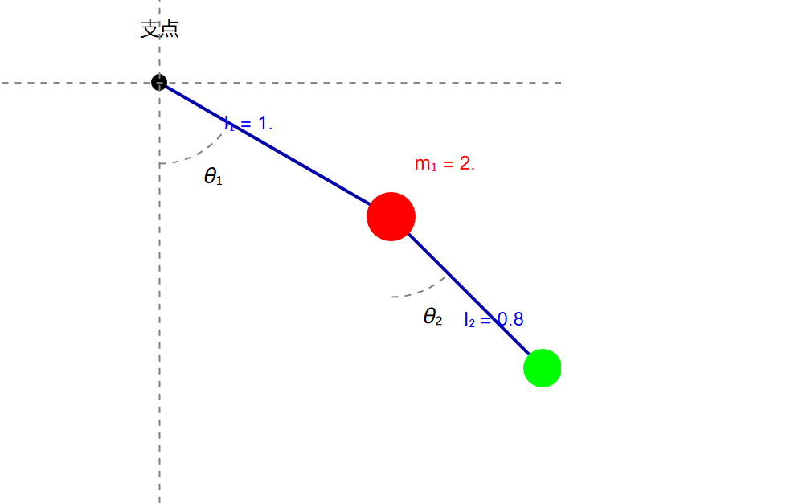

### 第二次课  对称性与守恒律

首先，我们上次课得到的运动方程为：
\[
\frac{{\partial L}}{{\partial q}} = \frac{{\text{d}}}{{{\text{d}}t}}\left( {\frac{{\partial L}}{{\partial \dot q}}} \right)\tag{1}
\]
🤔达朗贝尔先不讲算了

1. 这里直接给出比较常见的拉格朗日量形式 $L=T-V$ ，不加证明，可以尝试将其应用于静电场，重力场等存在势能的场，代入 $(1)$ 很容易得到与牛顿力学相近的结果，当然，这东西也可以用于求解==一些牛顿力学难以求解以及难以定义力的环境==

   > e.g.双摆问题
   >
   > 
   >
   > 我们可以得到
   > \[
   > \begin{gathered}
   >   \left\{ \begin{gathered}
   >   \left( {{x_1},{y_1}} \right) = \left( {{l_1}\sin {\theta _1},{l_1}\cos {\theta _1}} \right) \hfill \\
   >   \left( {{x_2},{y_2}} \right) = \left( {{l_1}\sin {\theta _1} + {l_2}\sin {\theta _2},{l_1}\cos {\theta _1} + {l_2}\cos {\theta _2}} \right) \hfill \\ 
   > \end{gathered}  \right. \hfill \\
   >    \Rightarrow  \hfill \\
   >   \left\{ \begin{gathered}
   >   \left( {{{\dot x}_1},{{\dot y}_1}} \right) = \left( {{l_1}\cos {\theta _1} \cdot {{\dot \theta }_1}, - {l_1}\sin {\theta _1} \cdot {{\dot \theta }_1}} \right) \hfill \\
   >   \left( {{{\dot x}_2},{{\dot y}_2}} \right) = \left( {{l_1}\cos {\theta _1} \cdot {{\dot \theta }_1} + {l_2}\cos {\theta _2} \cdot {{\dot \theta }_2}, - {l_1}\sin {\theta _1} \cdot {{\dot \theta }_1} - {l_2}\sin {\theta _2} \cdot {{\dot \theta }_2}} \right) \hfill \\ 
   > \end{gathered}  \right. \hfill \\
   >    \Rightarrow  \hfill \\
   >   L\left( {{x_1},{x_2},{y_1},{y_2},t} \right) \hfill \\
   >    = \frac{1}{2}{m_1}\left( {\dot x_1^2 + \dot y_1^2} \right) + \frac{1}{2}{m_2}\left( {\dot x_2^2 + \dot y_2^2} \right) + {m_1}g{y_1} + {m_2}g{y_2} \hfill \\
   >    = L\left( {{\theta _1},{\theta _2},t} \right) \hfill \\ 
   > \end{gathered}
   > \]
   > 此处原则来说就可以求解运动方程了，具体的交给计算机😊😊😊
   >
   > > 注：此处将 $(x,y)$ 代换为 $\theta$ 是必要的，因为$\theta_1,\theta_2$ 为独立坐标(二者不会相互影响)，而对于 $(x,y)$ ，$x$ 的变化必然导致相应 $y$ 的变化，二者并不独立，当然，对此变分也不是不可以，只是需要额外引入限制，如
   > > \[
   > > {x_1}\delta {x_1} + y_1\delta {y_1} = 0
   > > \]
   > > 等，对 $(y,\dot y)$ 进行代换，否则，我们不能单纯的从
   > > \[
   > > \int {\left( {f\delta x + g\delta y} \right){\text{d}}t = 0} 
   > > \]
   > > 得出
   > > \[
   > > f = g = 0
   > > \]

2. 我们将广义动量定义为
   \[
   {p_a} = \frac{{\partial L}}{{\partial {{\dot q}_a}}}
   \]
   可以试试，一般情况下，取常规的三维坐标，其与我们一般认知中的动量一致。

3. 

